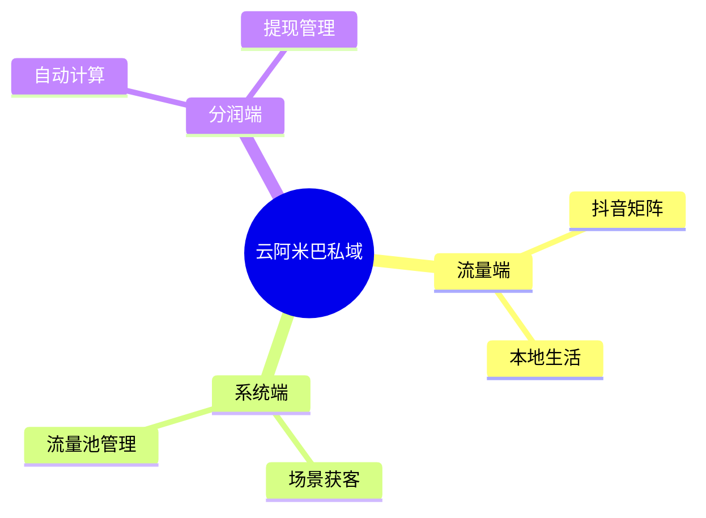

# 业务需求 (Business Requirements) - 智能自生长文档

> **提示词功能 (Prompt Function)**: 将本文件拖入 AI 对话框，即可激活“需求分析师”角色，协助拆解业务、生成文档与流程图。

## 1. 基础上下文 (The Two Basic Files)
### 1.1 角色档案：卡若 (Karuo)
- **身份**：私域运营与技术主理人，创业者。
- **核心逻辑**：云阿米巴（分不属于对方的钱、按价值分钱、流量绑定）。
- **性格**：INTP，逻辑强，说话大白话，关注结果与行动。
- **五行营销**：金(目标) -> 水(流程) -> 木(落地) -> 火(分析) -> 土(资源)。

### 1.2 开发与协作规范
- **目录结构**：严格遵守 1-10 目录结构，不新增顶层目录。
- **文档驱动**：先写文档再写代码。
- **技术栈**：Java, React, MongoDB。

## 2. 业务需求核心 (Master Content)
### 2.1 目标 (金)
- **核心目标**：通过流量+系统+现金分润，绑定合作方。
- **关键指标**：合作方留存率、分润金额、流量转化率。

### 2.2 流程 (水)
1.  **流量引入**：抖音本地号 -> 私域流量池。
2.  **系统承接**：场景获客页面 -> 微信管理 -> 数据分析。
3.  **价值分配**：自动计算分润 -> 现金结算。

### 2.3 落地 (木)
- **产品形态**：小程序/H5 获客页 + 后台管理系统。
- **关键功能**：
    - 流量池管理 (Traffic Pools)。
    - 分润计算器。
    - 合作方驾驶舱。

### 2.4 分析与迭代 (火)
- **数据复盘**：按周/月输出复盘文档。
- **迭代逻辑**：基于数据反馈调整分润比例或流量策略。

## 3. AI 协作指令 (Expanded Function)
**角色**：你是我（卡若）的产品合伙人。
**任务**：
1.  **拆解项目**：根据输入的简要描述，补充完整的业务流程。
2.  **生成脑图**：输出 Mermaid 思维导图 (`mindmap`)，展示业务结构。
3.  **生成流程图**：输出 Mermaid 序列图 (`sequenceDiagram`)，展示用户与系统的交互。
4.  **输出文档**：按“五行营销”结构生成详细需求文档。

### 示例 Mermaid

