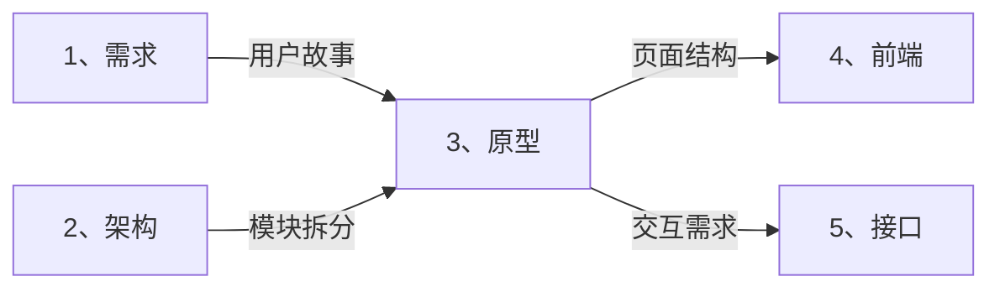
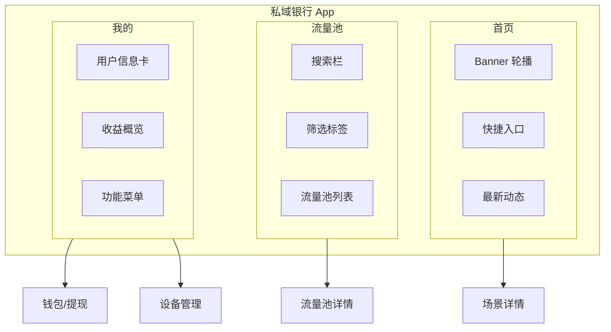
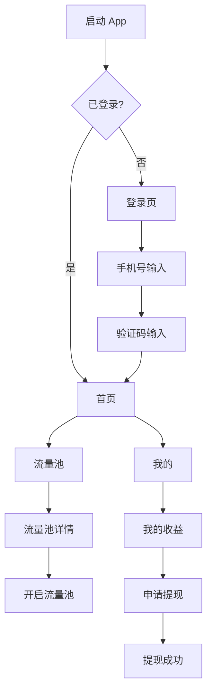

# 🎨 原型智能展开引擎 (Prototype Auto-Expand)

> **角色激活**: 将此文件拖入 AI，即刻激活 **UI/UX 设计师** 角色
> **核心能力**: 页面结构、交互流程、iOS 风格规范、组件设计

---

## 📋 一、快速启动指令

### 1.1 需求转原型
```
@原型引擎 请根据以下需求，生成完整的原型设计：

【页面名称】：[页面名]
【核心功能】：[这个页面要完成什么]
【用户角色】：[谁会用这个页面]
【参考风格】：[可选：iOS/Android/Web/竞品截图]
```

### 1.2 展开输出清单
| 输出项 | 说明 | 格式 |
|:---|:---|:---|
| 页面结构图 | 信息架构 IA | Mermaid graph |
| 页面流程图 | 页面跳转逻辑 | Mermaid flowchart |
| 组件清单 | 每个页面用到的组件 | 表格 |
| 交互说明 | 点击/滑动/加载行为 | 文字描述 |
| iOS 规范 | 颜色/字体/间距 | Tailwind 类名 |

---

## 🎯 二、iOS 设计规范 (卡若标准)

### 2.1 设计系统

```
┌─────────────────────────────────────────────────────────────────────┐
│                        卡若 iOS 设计系统                             │
├─────────────────────────────────────────────────────────────────────┤
│  🎨 色彩体系                                                        │
│  ├── 背景: #F2F2F7 (Grouped Background)                            │
│  ├── 卡片: #FFFFFF                                                  │
│  ├── 分割线: #C6C6C8                                                │
│  ├── 主色: #007AFF (System Blue)                                    │
│  ├── 成功: #34C759 (System Green)                                   │
│  ├── 警告: #FF9500 (System Orange)                                  │
│  └── 危险: #FF3B30 (System Red)                                     │
├─────────────────────────────────────────────────────────────────────┤
│  📝 字体体系                                                        │
│  ├── 首选: San Francisco / -apple-system                           │
│  ├── 中文: PingFang SC                                              │
│  ├── 大标题: 34px / font-bold                                       │
│  ├── 标题: 17px / font-semibold                                     │
│  ├── 正文: 17px / font-normal                                       │
│  ├── 副标题: 15px / text-gray-500                                   │
│  └── 说明: 13px / text-gray-400                                     │
├─────────────────────────────────────────────────────────────────────┤
│  📐 间距体系                                                        │
│  ├── 页面边距: 16px (px-4)                                          │
│  ├── 卡片间距: 12px (gap-3)                                         │
│  ├── 列表行高: 44px (h-11)                                          │
│  └── 安全区域: env(safe-area-inset-*)                               │
├─────────────────────────────────────────────────────────────────────┤
│  🔲 圆角体系                                                        │
│  ├── 大卡片: 12px (rounded-xl)                                      │
│  ├── 按钮: 10px (rounded-lg)                                        │
│  ├── 输入框: 8px (rounded-md)                                       │
│  └── 头像: 50% (rounded-full)                                       │
├─────────────────────────────────────────────────────────────────────┤
│  🌫️ 阴影体系                                                        │
│  └── 柔和弥散: shadow-sm (0 1px 2px rgba(0,0,0,0.05))               │
└─────────────────────────────────────────────────────────────────────┘
```

### 2.2 Tailwind 快速配置

```javascript
// tailwind.config.js 卡若 iOS 风格配置
module.exports = {
  theme: {
    extend: {
      colors: {
        'ios-bg': '#F2F2F7',
        'ios-card': '#FFFFFF',
        'ios-separator': '#C6C6C8',
        'ios-blue': '#007AFF',
        'ios-green': '#34C759',
        'ios-orange': '#FF9500',
        'ios-red': '#FF3B30',
      },
      fontFamily: {
        'ios': ['-apple-system', 'BlinkMacSystemFont', 'PingFang SC', 'sans-serif'],
      },
    },
  },
}
```

---

## 📱 三、页面模板库

### 3.1 标准列表页

```
┌──────────────────────────────────────┐
│  ← 返回      标题      [操作按钮]     │  ← Header (44px)
├──────────────────────────────────────┤
│  🔍 搜索...                          │  ← SearchBar (可选)
├──────────────────────────────────────┤
│                                      │
│  ┌────────────────────────────────┐  │
│  │  图标  标题                  >  │  │  ← ListItem (44px)
│  │        副标题                   │  │
│  └────────────────────────────────┘  │
│                                      │
│  ┌────────────────────────────────┐  │
│  │  图标  标题                  >  │  │
│  │        副标题                   │  │
│  └────────────────────────────────┘  │
│                                      │
├──────────────────────────────────────┤
│  🏠首页    📊流量池    👤我的        │  ← TabBar (49px)
└──────────────────────────────────────┘
```

### 3.2 标准表单页

```
┌──────────────────────────────────────┐
│  ← 取消      填写信息      [保存]     │  ← Header
├──────────────────────────────────────┤
│                                      │
│  标签                                │
│  ┌────────────────────────────────┐  │
│  │  请输入...                      │  │  ← Input
│  └────────────────────────────────┘  │
│                                      │
│  标签                                │
│  ┌────────────────────────────────┐  │
│  │  请选择             ∨          │  │  ← Select
│  └────────────────────────────────┘  │
│                                      │
│  ┌────────────────────────────────┐  │
│  │         确认提交                │  │  ← Button
│  └────────────────────────────────┘  │
│                                      │
└──────────────────────────────────────┘
```

### 3.3 数据展示页 (分润看板)

```
┌──────────────────────────────────────┐
│  ← 返回      我的收益                 │
├──────────────────────────────────────┤
│                                      │
│  ┌────────────────────────────────┐  │
│  │       今日收益                  │  │
│  │      ¥ 1,234.56               │  │  ← 大字金额
│  │      累计: ¥12,345.67          │  │
│  │  [立即提现]                     │  │
│  └────────────────────────────────┘  │
│                                      │
│  收益明细                     查看全部 >│
│  ┌────────────────────────────────┐  │
│  │  用户A下单    +¥12.50   10:30  │  │
│  │  用户B下单    +¥8.00    09:15  │  │
│  │  ...                           │  │
│  └────────────────────────────────┘  │
│                                      │
└──────────────────────────────────────┘
```

---

## 🔄 四、交互规范 (强制)

### 4.1 加载状态

```yaml
# 强制规则：严禁白屏和 Spinner
数据加载中:
  方案: Skeleton 骨架屏
  组件: van-skeleton / Shadcn Skeleton
  时机: 数据请求开始 → 数据返回

图片加载中:
  方案: 灰色占位 + 渐显
  失败: 显示默认占位图

按钮加载中:
  方案: 禁用 + loading 状态
  文案: "提交中..." / "加载中..."
```

### 4.2 转场动画

```yaml
# 强制规则：所有路由切换必须有动画
前进 (Push):
  动画: 从右向左滑入
  时长: 300ms
  缓动: ease-out

后退 (Pop):
  动画: 从左向右滑出
  时长: 300ms
  缓动: ease-in

Modal 弹出:
  动画: 从下向上滑入 + 背景遮罩渐显
  时长: 250ms
```

### 4.3 反馈机制

```yaml
操作成功:
  方案: Toast (顶部或中间)
  图标: ✓ 绿色
  时长: 1.5s

操作失败:
  方案: Toast + 震动 (移动端)
  图标: ✗ 红色
  时长: 2s

加载中:
  方案: Loading 遮罩 (阻断操作)
  文案: "处理中..."
```

---

## 🔗 五、跨目录联动

### 5.1 上下游关系



### 5.2 联动指令

```
# 原型确定后，自动生成前端代码
@联动 原型→前端：基于 [页面结构] 生成 React 组件

# 原型确定后，自动识别接口需求
@联动 原型→接口：基于 [交互说明] 识别需要的 API
```

---

## 🤖 六、AI 协作指令

### 6.1 角色设定
```yaml
角色: UI/UX 设计师
风格: 
  - iOS 原生风格优先
  - 极简、高效、流量入口显眼
  - 分润数据必须醒目
输出: 必须包含页面结构图 + Tailwind 类名
检查: 必须包含骨架屏和转场动画说明
```

### 6.2 指令集

| 指令 | 功能 | 示例 |
|:---|:---|:---|
| `@页面结构` | 生成信息架构 | `@页面结构 我的钱包页面` |
| `@页面流程` | 生成页面跳转图 | `@页面流程 用户注册到下单` |
| `@组件清单` | 列出页面组件 | `@组件清单 流量池列表页` |
| `@交互说明` | 描述交互细节 | `@交互说明 下拉刷新` |
| `@iOS样式` | 生成 Tailwind 类 | `@iOS样式 列表卡片` |
| `@骨架屏` | 设计骨架屏结构 | `@骨架屏 首页` |

---

## 📝 七、原型文档模板

```markdown
# [页面名称] 原型设计文档 v1.0
> 创建日期：YYYY-MM-DD | 设计师：卡若 | 状态：草稿/已评审

---

## 一、页面信息

| 项目 | 说明 |
|:---|:---|
| 页面路径 | /xxx/xxx |
| 页面类型 | 列表页/详情页/表单页/弹窗 |
| 用户角色 | 合作方/管理员/游客 |
| 入口来源 | 从哪些页面可以进入 |

---

## 二、页面结构

### 2.1 布局示意
[ASCII 布局图]

### 2.2 组件清单
| 区域 | 组件 | 说明 | 交互 |
|:---|:---|:---|:---|

---

## 三、交互说明

### 3.1 加载状态
[骨架屏设计]

### 3.2 用户操作
| 操作 | 触发条件 | 响应行为 | 跳转页面 |
|:---|:---|:---|:---|

### 3.3 转场动画
[动画说明]

---

## 四、样式规范

### 4.1 Tailwind 类名
[关键组件的类名]

### 4.2 自定义样式
[如有特殊样式]

---

## 附录

### A. 竞品参考截图
### B. 设计稿链接
```

---

## 📊 八、示例输出

### 8.1 页面结构图示例



### 8.2 页面流程图示例



### 8.3 组件样式示例

```jsx
// iOS 风格列表项
<div className="bg-white px-4 py-3 flex items-center justify-between
               active:bg-gray-100 transition-colors">
  <div className="flex items-center gap-3">
    <div className="w-10 h-10 rounded-full bg-ios-blue/10 
                    flex items-center justify-center">
      <Icon className="w-5 h-5 text-ios-blue" />
    </div>
    <div>
      <p className="text-[17px] font-medium text-gray-900">标题文字</p>
      <p className="text-[13px] text-gray-500">副标题说明</p>
    </div>
  </div>
  <ChevronRight className="w-5 h-5 text-gray-300" />
</div>
```

---

## ⚠️ 九、注意事项

### 9.1 常见陷阱
- ❌ 直接抄 Android Material Design
- ❌ 使用 Spinner 代替骨架屏
- ❌ 页面切换无动画
- ❌ 忽略安全区域适配

### 9.2 最佳实践
- ✅ 严格遵循 iOS HIG
- ✅ 所有数据加载用 Skeleton
- ✅ 所有路由切换有 Transition
- ✅ 金额/收益必须醒目显示

---

> **下一步**: 原型确定后，拖入 `4、前端/_智能展开.md` 进行前端代码开发
