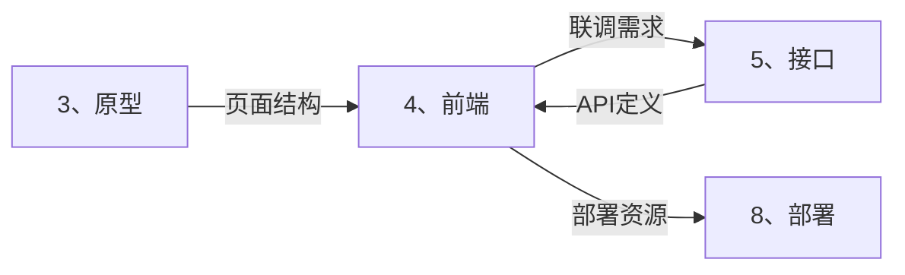

# ⚛️ 前端智能展开引擎 (Frontend Auto-Expand)

> **角色激活**: 将此文件拖入 AI，即刻激活 **前端技术专家** 角色
> **核心能力**: React 组件、Tailwind 样式、iOS 风格、性能优化

---

## 📋 一、快速启动指令

### 1.1 页面代码生成
```
@前端引擎 请根据以下需求，生成完整的前端代码：

【页面名称】：[页面名]
【页面功能】：[这个页面要完成什么]
【页面类型】：[列表页/详情页/表单页/弹窗]
【接口依赖】：[可选：需要调用哪些 API]
【特殊需求】：[可选：骨架屏/无限滚动/下拉刷新等]
```

### 1.2 展开输出清单
| 输出项 | 说明 | 格式 |
|:---|:---|:---|
| 页面组件 | 完整的 React 组件代码 | TSX |
| 样式类名 | Tailwind CSS 类名 | className |
| 自定义 Hook | 数据获取/状态管理 | TypeScript |
| 类型定义 | 接口和数据类型 | TypeScript |
| 骨架屏组件 | 加载状态 UI | TSX |

---

## 🛠️ 二、技术栈规范

### 2.1 卡若标准前端栈

```
┌─────────────────────────────────────────────────────────────────────┐
│                        卡若前端技术栈                                │
├─────────────────────────────────────────────────────────────────────┤
│  🏗️ 框架层                                                          │
│  ├── React 18+ (首选) / Vue 3 + Nuxt                               │
│  ├── Next.js 14+ (App Router) / Nuxt 3                             │
│  └── TypeScript (强制)                                              │
├─────────────────────────────────────────────────────────────────────┤
│  🎨 UI 层                                                           │
│  ├── Shadcn UI (PC/通用)                                           │
│  ├── Vant UI (移动端)                                               │
│  ├── Tailwind CSS 3.x (原子化样式)                                  │
│  └── Framer Motion / CSS Transition (动画)                          │
├─────────────────────────────────────────────────────────────────────┤
│  📦 状态管理                                                        │
│  ├── React Query / SWR (服务端状态)                                 │
│  ├── Zustand (客户端状态)                                           │
│  └── Context API (轻量场景)                                         │
├─────────────────────────────────────────────────────────────────────┤
│  🔧 工具链                                                          │
│  ├── Vite / Turbopack (构建)                                       │
│  ├── ESLint + Prettier (代码规范)                                   │
│  └── Axios / fetch (网络请求)                                       │
└─────────────────────────────────────────────────────────────────────┘
```

### 2.2 目录结构规范

```
/src
├── /app                    # 页面路由 (Next.js App Router)
│   ├── /(auth)             # 认证相关路由组
│   │   ├── /login
│   │   └── /register
│   ├── /(main)             # 主应用路由组
│   │   ├── /scenarios      # 场景获客
│   │   │   ├── /new        # 新建场景 (固定路径!)
│   │   │   └── /[id]       # 场景详情
│   │   ├── /traffic        # 流量池
│   │   └── /mine           # 我的
│   ├── /api                # API 路由
│   └── layout.tsx          # 根布局
│
├── /components             # 组件库
│   ├── /ui                 # Shadcn 基础组件
│   │   ├── button.tsx
│   │   ├── skeleton.tsx    # 骨架屏 (必须!)
│   │   └── ...
│   ├── /business           # 业务组件
│   │   ├── UserCard.tsx
│   │   ├── TrafficPoolItem.tsx
│   │   └── ...
│   └── /layout             # 布局组件
│       ├── Header.tsx
│       ├── TabBar.tsx
│       └── PageContainer.tsx
│
├── /hooks                  # 自定义 Hooks
│   ├── useAuth.ts
│   ├── useTrafficPool.ts
│   └── usePagination.ts
│
├── /lib                    # 工具库
│   ├── api.ts              # API 封装
│   ├── utils.ts            # 工具函数
│   └── constants.ts        # 常量
│
├── /styles                 # 样式
│   └── globals.css         # 全局样式 + Tailwind
│
└── /types                  # 类型定义
    ├── api.d.ts
    └── business.d.ts
```

---

## 🎨 三、iOS 风格组件库

### 3.1 页面容器

```tsx
// components/layout/PageContainer.tsx
interface PageContainerProps {
  children: React.ReactNode;
  title?: string;
  showBack?: boolean;
  rightAction?: React.ReactNode;
  loading?: boolean;
}

export function PageContainer({
  children,
  title,
  showBack = true,
  rightAction,
  loading = false,
}: PageContainerProps) {
  return (
    <div className="min-h-screen bg-ios-bg">
      {/* iOS 风格 Header */}
      <header className="sticky top-0 z-50 h-11 bg-white/80 backdrop-blur-xl
                        border-b border-ios-separator flex items-center px-4">
        {showBack && (
          <button onClick={() => router.back()} className="text-ios-blue">
            <ChevronLeft className="w-6 h-6" />
          </button>
        )}
        <h1 className="flex-1 text-center text-[17px] font-semibold">
          {title}
        </h1>
        <div className="w-10">{rightAction}</div>
      </header>

      {/* 内容区域 */}
      <main className="pb-safe">
        {loading ? <PageSkeleton /> : children}
      </main>
    </div>
  );
}
```

### 3.2 iOS 列表项

```tsx
// components/ui/ListItem.tsx
interface ListItemProps {
  icon?: React.ReactNode;
  title: string;
  subtitle?: string;
  value?: string | React.ReactNode;
  arrow?: boolean;
  onClick?: () => void;
}

export function ListItem({
  icon,
  title,
  subtitle,
  value,
  arrow = true,
  onClick,
}: ListItemProps) {
  return (
    <div
      onClick={onClick}
      className="bg-white px-4 py-3 flex items-center justify-between
                 active:bg-gray-100 transition-colors cursor-pointer"
    >
      <div className="flex items-center gap-3">
        {icon && (
          <div className="w-8 h-8 rounded-lg bg-ios-blue/10 
                          flex items-center justify-center text-ios-blue">
            {icon}
          </div>
        )}
        <div>
          <p className="text-[17px] text-gray-900">{title}</p>
          {subtitle && (
            <p className="text-[13px] text-gray-500 mt-0.5">{subtitle}</p>
          )}
        </div>
      </div>
      <div className="flex items-center gap-2">
        {value && (
          <span className="text-[15px] text-gray-500">{value}</span>
        )}
        {arrow && <ChevronRight className="w-5 h-5 text-gray-300" />}
      </div>
    </div>
  );
}
```

### 3.3 骨架屏组件 (强制使用)

```tsx
// components/ui/skeleton.tsx
import { cn } from "@/lib/utils";

interface SkeletonProps {
  className?: string;
}

// 基础骨架
export function Skeleton({ className }: SkeletonProps) {
  return (
    <div
      className={cn(
        "animate-pulse rounded-md bg-gray-200",
        className
      )}
    />
  );
}

// 列表项骨架
export function ListItemSkeleton() {
  return (
    <div className="bg-white px-4 py-3 flex items-center gap-3">
      <Skeleton className="w-10 h-10 rounded-full" />
      <div className="flex-1">
        <Skeleton className="h-4 w-24 mb-2" />
        <Skeleton className="h-3 w-32" />
      </div>
    </div>
  );
}

// 卡片骨架
export function CardSkeleton() {
  return (
    <div className="bg-white rounded-xl p-4 m-4">
      <Skeleton className="h-6 w-1/3 mb-4" />
      <Skeleton className="h-10 w-1/2 mb-2" />
      <Skeleton className="h-4 w-2/3" />
    </div>
  );
}

// 页面骨架
export function PageSkeleton() {
  return (
    <div className="space-y-4 p-4">
      <CardSkeleton />
      <div className="space-y-1">
        {[...Array(5)].map((_, i) => (
          <ListItemSkeleton key={i} />
        ))}
      </div>
    </div>
  );
}
```

### 3.4 金额展示组件 (云阿米巴核心)

```tsx
// components/business/MoneyDisplay.tsx
interface MoneyDisplayProps {
  amount: number;
  label?: string;
  size?: 'sm' | 'md' | 'lg';
  trend?: 'up' | 'down' | 'none';
}

export function MoneyDisplay({
  amount,
  label,
  size = 'md',
  trend = 'none',
}: MoneyDisplayProps) {
  const sizeClasses = {
    sm: 'text-xl',
    md: 'text-3xl',
    lg: 'text-4xl',
  };

  const trendColors = {
    up: 'text-ios-green',
    down: 'text-ios-red',
    none: 'text-gray-900',
  };

  return (
    <div className="text-center">
      {label && (
        <p className="text-[13px] text-gray-500 mb-1">{label}</p>
      )}
      <p className={cn(
        'font-bold tabular-nums',
        sizeClasses[size],
        trendColors[trend]
      )}>
        <span className="text-base mr-1">¥</span>
        {amount.toLocaleString('zh-CN', {
          minimumFractionDigits: 2,
          maximumFractionDigits: 2,
        })}
      </p>
    </div>
  );
}
```

---

## 🔄 四、交互规范代码

### 4.1 路由转场动画

```tsx
// app/template.tsx - 全局转场动画
'use client';

import { motion } from 'framer-motion';

export default function Template({ children }: { children: React.ReactNode }) {
  return (
    <motion.div
      initial={{ x: 20, opacity: 0 }}
      animate={{ x: 0, opacity: 1 }}
      exit={{ x: -20, opacity: 0 }}
      transition={{ duration: 0.3, ease: 'easeOut' }}
    >
      {children}
    </motion.div>
  );
}
```

### 4.2 下拉刷新

```tsx
// hooks/usePullRefresh.ts
import { useState, useCallback } from 'react';

export function usePullRefresh(onRefresh: () => Promise<void>) {
  const [refreshing, setRefreshing] = useState(false);

  const handleRefresh = useCallback(async () => {
    setRefreshing(true);
    try {
      await onRefresh();
    } finally {
      setRefreshing(false);
    }
  }, [onRefresh]);

  return { refreshing, handleRefresh };
}
```

### 4.3 无限滚动

```tsx
// hooks/useInfiniteScroll.ts
import { useEffect, useRef, useCallback } from 'react';

export function useInfiniteScroll(
  onLoadMore: () => void,
  hasMore: boolean,
  loading: boolean
) {
  const observerRef = useRef<IntersectionObserver | null>(null);
  const loadMoreRef = useCallback(
    (node: HTMLDivElement | null) => {
      if (loading) return;
      if (observerRef.current) observerRef.current.disconnect();
      
      observerRef.current = new IntersectionObserver((entries) => {
        if (entries[0].isIntersecting && hasMore) {
          onLoadMore();
        }
      });
      
      if (node) observerRef.current.observe(node);
    },
    [loading, hasMore, onLoadMore]
  );

  return loadMoreRef;
}
```

---

## 🔗 五、API 调用规范

### 5.1 统一请求封装

```typescript
// lib/api.ts
import axios from 'axios';
import { toast } from 'sonner';

const api = axios.create({
  baseURL: process.env.NEXT_PUBLIC_API_URL,
  timeout: 10000,
});

// 请求拦截
api.interceptors.request.use((config) => {
  const token = localStorage.getItem('token');
  if (token) {
    config.headers.Authorization = `Bearer ${token}`;
  }
  return config;
});

// 响应拦截
api.interceptors.response.use(
  (response) => {
    const { code, message, data } = response.data;
    if (code !== 200) {
      toast.error(message || '请求失败');
      return Promise.reject(new Error(message));
    }
    return data;
  },
  (error) => {
    if (error.response?.status === 401) {
      // Token 过期，跳转登录
      window.location.href = '/login';
    }
    toast.error('网络错误，请稍后重试');
    return Promise.reject(error);
  }
);

export { api };
```

### 5.2 React Query 封装

```typescript
// hooks/useTrafficPool.ts
import { useQuery, useMutation, useQueryClient } from '@tanstack/react-query';
import { api } from '@/lib/api';

// 获取流量池列表
export function useTrafficPools(page = 1, pageSize = 20) {
  return useQuery({
    queryKey: ['trafficPools', page, pageSize],
    queryFn: () => api.get('/api/v1/traffic-pools', {
      params: { page, pageSize }
    }),
  });
}

// 创建流量池
export function useCreateTrafficPool() {
  const queryClient = useQueryClient();
  
  return useMutation({
    mutationFn: (data: CreateTrafficPoolDTO) => 
      api.post('/api/v1/traffic-pools', data),
    onSuccess: () => {
      queryClient.invalidateQueries({ queryKey: ['trafficPools'] });
      toast.success('创建成功');
    },
  });
}
```

---

## 📱 六、页面模板

### 6.1 列表页模板

```tsx
// app/(main)/traffic/page.tsx
'use client';

import { useState } from 'react';
import { PageContainer } from '@/components/layout/PageContainer';
import { ListItem } from '@/components/ui/ListItem';
import { ListItemSkeleton } from '@/components/ui/skeleton';
import { useTrafficPools } from '@/hooks/useTrafficPool';
import { useInfiniteScroll } from '@/hooks/useInfiniteScroll';

export default function TrafficPoolPage() {
  const [page, setPage] = useState(1);
  const { data, isLoading, hasMore } = useTrafficPools(page);

  const loadMoreRef = useInfiniteScroll(
    () => setPage((p) => p + 1),
    hasMore,
    isLoading
  );

  return (
    <PageContainer title="流量池" showBack={false}>
      {/* 搜索栏 */}
      <div className="sticky top-11 z-40 bg-ios-bg px-4 py-2">
        <input
          type="search"
          placeholder="搜索流量池..."
          className="w-full h-9 px-4 bg-gray-200 rounded-lg
                     text-[15px] placeholder:text-gray-400"
        />
      </div>

      {/* 列表区域 */}
      <div className="mt-2">
        {isLoading && !data ? (
          // 首次加载：显示骨架屏
          [...Array(10)].map((_, i) => <ListItemSkeleton key={i} />)
        ) : (
          // 数据列表
          <>
            {data?.list.map((item) => (
              <ListItem
                key={item.id}
                icon={<Pool className="w-4 h-4" />}
                title={item.name}
                subtitle={`${item.count} 条流量`}
                value={`¥${item.revenue}`}
                onClick={() => router.push(`/traffic/${item.id}`)}
              />
            ))}
            
            {/* 加载更多触发器 */}
            <div ref={loadMoreRef} className="h-10 flex items-center justify-center">
              {isLoading && <span className="text-gray-400">加载中...</span>}
              {!hasMore && <span className="text-gray-400">没有更多了</span>}
            </div>
          </>
        )}
      </div>
    </PageContainer>
  );
}
```

### 6.2 表单页模板

```tsx
// app/(main)/scenarios/new/page.tsx
'use client';

import { useForm } from 'react-hook-form';
import { zodResolver } from '@hookform/resolvers/zod';
import { z } from 'zod';
import { PageContainer } from '@/components/layout/PageContainer';
import { Button } from '@/components/ui/button';
import { Input } from '@/components/ui/input';
import { useCreateScenario } from '@/hooks/useScenario';

const schema = z.object({
  name: z.string().min(2, '名称至少2个字符'),
  description: z.string().optional(),
});

type FormData = z.infer<typeof schema>;

export default function NewScenarioPage() {
  const { mutate, isPending } = useCreateScenario();
  
  const {
    register,
    handleSubmit,
    formState: { errors },
  } = useForm<FormData>({
    resolver: zodResolver(schema),
  });

  const onSubmit = (data: FormData) => {
    mutate(data);
  };

  return (
    <PageContainer
      title="新建场景"
      rightAction={
        <button
          onClick={handleSubmit(onSubmit)}
          disabled={isPending}
          className="text-ios-blue font-medium disabled:opacity-50"
        >
          {isPending ? '保存中...' : '保存'}
        </button>
      }
    >
      <form className="p-4 space-y-6">
        {/* 场景名称 */}
        <div>
          <label className="text-[13px] text-gray-500 mb-2 block">
            场景名称
          </label>
          <Input
            {...register('name')}
            placeholder="请输入场景名称"
            className="h-11"
          />
          {errors.name && (
            <p className="text-ios-red text-[13px] mt-1">
              {errors.name.message}
            </p>
          )}
        </div>

        {/* 场景描述 */}
        <div>
          <label className="text-[13px] text-gray-500 mb-2 block">
            场景描述
          </label>
          <textarea
            {...register('description')}
            placeholder="请输入场景描述（可选）"
            className="w-full h-24 px-3 py-2 bg-white border border-gray-200 
                       rounded-lg text-[15px] resize-none"
          />
        </div>
      </form>
    </PageContainer>
  );
}
```

---

## 🔗 七、跨目录联动

### 7.1 上下游关系



### 7.2 联动指令

```
# 基于原型生成组件
@联动 原型→前端：基于 [页面结构] 生成 React 组件代码

# 基于接口生成 Hook
@联动 接口→前端：基于 [API文档] 生成 React Query Hook

# 生成完整页面
@联动 全量：基于 [需求+原型+接口] 生成完整页面代码
```

---

## 🤖 八、AI 协作指令

### 8.1 角色设定
```yaml
角色: 前端技术专家
风格: 
  - iOS 原生风格，像素级还原
  - TypeScript 强类型
  - 组件化、Hook 化
输出: 必须包含完整可运行代码
检查: 必须包含骨架屏、类型定义、错误处理
```

### 8.2 指令集

| 指令 | 功能 | 示例 |
|:---|:---|:---|
| `@生成页面` | 生成完整页面代码 | `@生成页面 流量池列表` |
| `@生成组件` | 生成单个组件 | `@生成组件 用户信息卡片` |
| `@生成Hook` | 生成自定义 Hook | `@生成Hook 分页加载` |
| `@生成类型` | 生成 TypeScript 类型 | `@生成类型 用户信息` |
| `@样式优化` | 优化 Tailwind 类名 | `@样式优化 [代码片段]` |
| `@性能优化` | 分析性能问题 | `@性能优化 列表渲染` |

---

## ⚠️ 九、注意事项

### 9.1 强制规则
```yaml
必须做:
  - [ ] 所有数据加载使用 Skeleton 骨架屏
  - [ ] 所有路由切换有转场动画
  - [ ] 所有组件使用 TypeScript
  - [ ] 所有 API 调用封装在 Hook 中
  - [ ] 所有表单使用 react-hook-form + zod

禁止做:
  - [ ] 使用 Spinner/Loading 代替骨架屏
  - [ ] 硬编码 API 地址
  - [ ] 使用 any 类型
  - [ ] 在组件中直接调用 fetch
```

### 9.2 常见问题

| 问题 | 解决方案 |
|:---|:---|
| 首屏白屏 | 添加 Skeleton 骨架屏 |
| 页面闪烁 | 添加路由转场动画 |
| 类型报错 | 完善 TypeScript 类型定义 |
| 性能问题 | 使用 React.memo / useMemo |

---

> **下一步**: 前端开发完成后，拖入 `5、接口/_智能展开.md` 进行 API 联调
