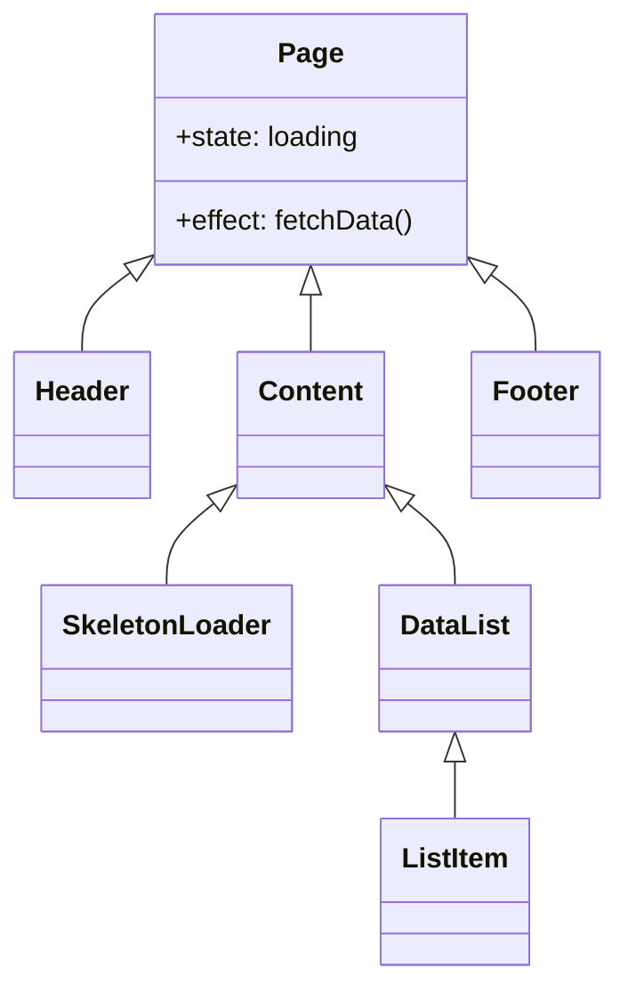

# 前端开发规范 (Frontend Specs) - 智能自生长文档

> **提示词功能 (Prompt Function)**: 将本文件拖入 AI 对话框，即可激活“前端技术专家”角色，生成符合 iOS 风格的 React 代码。

## 1. 基础上下文 (The Two Basic Files)
### 1.1 角色档案：卡若 (Karuo)
- **视觉标准**：像素级复刻 iOS (San Francisco, 1:1 间距, 弥散阴影)。
- **体验标准**：无白屏 (Skeleton)，丝滑转场 (Transition)。

### 1.2 技术栈
- **核心**：React + Shadcn UI + Tailwind CSS。
- **辅助**：Vant UI (移动端组件)。
- **构建**：Vite / Next.js。

## 2. 开发规范核心 (Master Content)
### 2.1 视觉与风格 (iOS)
- **字体**：San Francisco > PingFang SC。
- **色彩**：
  - 背景：`#F2F2F7` (Grouped Background)。
  - 分割：`#C6C6C8`。
  - 交互：`#007AFF` (System Blue)。
- **细节**：
  - 圆角：统一 `rounded-lg` 或 `rounded-xl`。
  - 阴影：柔和弥散，非生硬投影。

### 2.2 交互与性能 (Mandatory)
- **骨架屏**：数据加载必须显示 Skeleton，严禁 Spinner。
- **转场**：路由切换必须有动画。
- **图片**：懒加载 + 失败占位。

### 2.3 目录结构
- `/src/components`: 原子组件。
- `/scenarios/new`: 场景获客页。
- `/src/hooks`: 逻辑复用。

## 3. AI 协作指令 (Expanded Function)
**角色**：你是我（卡若）的前端主程。
**任务**：
1.  **代码生成**：生成 React 组件代码，**必须**包含 Tailwind 类名。
2.  **样式检查**：确保所有 UI 元素符合 iOS 规范（检查圆角、阴影、字体）。
3.  **结构分析**：用 Mermaid 展示组件依赖。

### 示例 Mermaid (组件结构)

