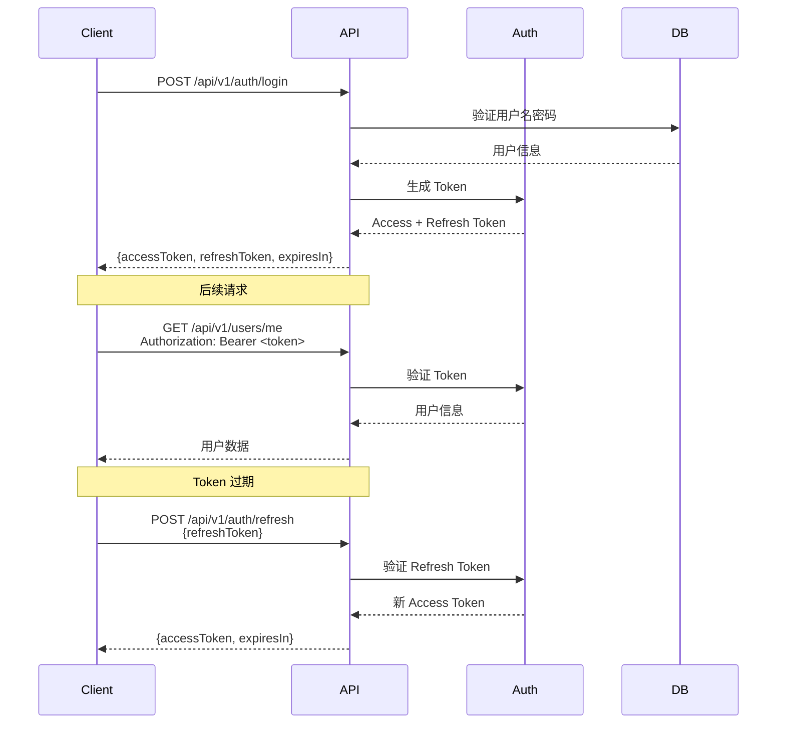
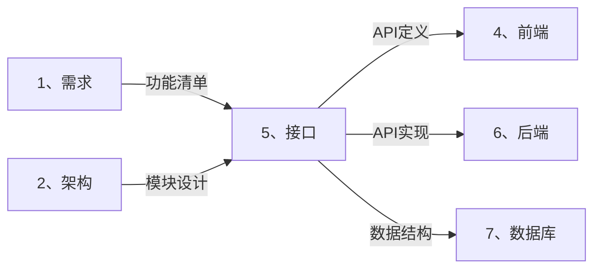
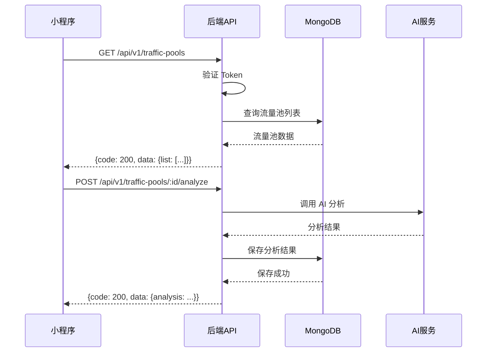

# 🔌 接口智能展开引擎 (API Auto-Expand)

> **角色激活**: 将此文件拖入 AI，即刻激活 **API 架构师** 角色
> **核心能力**: RESTful 设计、接口文档、错误码、认证鉴权

---

## 📋 一、快速启动指令

### 1.1 功能转接口
```
@接口引擎 请根据以下功能需求，生成完整的 API 接口文档：

【模块名称】：[模块名]
【核心功能】：[功能描述]
【用户角色】：[谁会调用这些接口]
【特殊需求】：[可选：分页/鉴权/文件上传等]
```

### 1.2 展开输出清单
| 输出项 | 说明 | 格式 |
|:---|:---|:---|
| 接口清单 | 所有 API 列表 | 表格 |
| 详细文档 | 每个接口的详细定义 | Markdown |
| 请求示例 | cURL / JSON 示例 | 代码块 |
| 响应示例 | 成功/失败响应 | JSON |
| 时序图 | 接口调用流程 | Mermaid |

---

## 📐 二、接口设计规范

### 2.1 URL 命名规范

```yaml
# 基础规则
前缀: /api/v1
资源名: 复数名词，小写，中划线分隔
嵌套: 最多两层

# 示例
✅ 正确:
  - GET    /api/v1/users              # 用户列表
  - GET    /api/v1/users/:id          # 用户详情
  - POST   /api/v1/users              # 创建用户
  - PUT    /api/v1/users/:id          # 更新用户
  - DELETE /api/v1/users/:id          # 删除用户
  - GET    /api/v1/users/:id/orders   # 用户的订单列表

❌ 错误:
  - GET    /api/v1/getUser            # 动词命名
  - GET    /api/v1/User               # 大写
  - GET    /api/v1/user_list          # 下划线
```

### 2.2 HTTP 方法规范

| 方法 | 用途 | 幂等 | 示例 |
|:---:|:---|:---:|:---|
| GET | 查询资源 | ✅ | 获取用户信息 |
| POST | 创建资源 | ❌ | 创建订单 |
| PUT | 全量更新 | ✅ | 更新用户资料 |
| PATCH | 部分更新 | ✅ | 修改密码 |
| DELETE | 删除资源 | ✅ | 删除文章 |

### 2.3 统一响应格式

```typescript
// 成功响应
interface SuccessResponse<T> {
  code: 200;
  message: "success";
  data: T;
  timestamp: number;
}

// 分页响应
interface PaginatedResponse<T> {
  code: 200;
  message: "success";
  data: {
    list: T[];
    total: number;
    page: number;
    pageSize: number;
    totalPages: number;
  };
  timestamp: number;
}

// 错误响应
interface ErrorResponse {
  code: number;      // 非 200
  message: string;   // 错误描述
  data: null;
  timestamp: number;
  traceId?: string;  // 可选：追踪 ID
}
```

### 2.4 状态码规范

```yaml
# HTTP 状态码
200: 成功
201: 创建成功
204: 删除成功（无返回体）
400: 请求参数错误
401: 未认证（Token 无效/过期）
403: 无权限
404: 资源不存在
429: 请求过于频繁
500: 服务器内部错误

# 业务状态码（在 response.code 中）
200: 成功
1001: 参数校验失败
1002: 业务逻辑错误
2001: 用户不存在
2002: 密码错误
2003: 验证码错误
3001: 余额不足
3002: 提现失败
```

---

## 🔐 三、认证鉴权规范

### 3.1 JWT Token 方案

```yaml
# Token 结构
Header:
  alg: HS256
  typ: JWT

Payload:
  sub: user_id        # 用户 ID
  exp: timestamp      # 过期时间
  iat: timestamp      # 签发时间
  role: "user"        # 用户角色

# 传递方式
Header: Authorization: Bearer <token>

# Token 刷新
Access Token: 2小时
Refresh Token: 7天
```

### 3.2 认证流程



---

## 📄 四、接口文档模板

### 4.1 单接口模板

```markdown
## 接口：[接口名称]

### 基本信息
| 项目 | 说明 |
|:---|:---|
| URL | `/api/v1/xxx` |
| Method | `POST` |
| 认证 | 需要 Bearer Token |
| 权限 | user / admin |

### 请求参数

#### Headers
| 参数 | 类型 | 必填 | 说明 |
|:---|:---|:---:|:---|
| Authorization | string | ✅ | Bearer Token |
| Content-Type | string | ✅ | application/json |

#### Body
| 参数 | 类型 | 必填 | 说明 | 示例 |
|:---|:---|:---:|:---|:---|
| name | string | ✅ | 名称 | "流量池A" |
| count | number | ❌ | 数量 | 100 |

### 响应

#### 成功响应 (200)
```json
{
  "code": 200,
  "message": "success",
  "data": {
    "id": "xxx",
    "name": "流量池A"
  },
  "timestamp": 1678888888
}
```

#### 错误响应
| code | message | 说明 |
|:---:|:---|:---|
| 1001 | 参数校验失败 | 检查必填字段 |
| 2001 | 流量池已存在 | 名称重复 |

### 请求示例
```bash
curl -X POST 'https://api.example.com/api/v1/traffic-pools' \
  -H 'Authorization: Bearer xxx' \
  -H 'Content-Type: application/json' \
  -d '{"name": "流量池A"}'
```
```

### 4.2 模块接口清单模板

```markdown
# [模块名称] 接口文档

## 接口清单

| 序号 | 接口名称 | Method | URL | 认证 | 说明 |
|:---:|:---|:---:|:---|:---:|:---|
| 1 | 获取列表 | GET | /api/v1/xxx | ✅ | 分页查询 |
| 2 | 获取详情 | GET | /api/v1/xxx/:id | ✅ | 单条查询 |
| 3 | 创建 | POST | /api/v1/xxx | ✅ | 新增 |
| 4 | 更新 | PUT | /api/v1/xxx/:id | ✅ | 全量更新 |
| 5 | 删除 | DELETE | /api/v1/xxx/:id | ✅ | 软删除 |

## 详细接口

### 1. 获取列表
[详细文档...]

### 2. 获取详情
[详细文档...]
```

---

## 📊 五、常用接口模板

### 5.1 用户认证模块

```yaml
# 登录
POST /api/v1/auth/login
Body: { mobile, code }
Response: { accessToken, refreshToken, expiresIn, user }

# 刷新 Token
POST /api/v1/auth/refresh
Body: { refreshToken }
Response: { accessToken, expiresIn }

# 获取当前用户
GET /api/v1/auth/me
Response: { id, mobile, nickname, avatar, ... }

# 登出
POST /api/v1/auth/logout
Response: { }
```

### 5.2 CRUD 模块

```yaml
# 列表查询（分页）
GET /api/v1/resources?page=1&pageSize=20&keyword=xxx
Response: { list, total, page, pageSize, totalPages }

# 详情查询
GET /api/v1/resources/:id
Response: { id, ... }

# 创建
POST /api/v1/resources
Body: { ... }
Response: { id, ... }

# 更新
PUT /api/v1/resources/:id
Body: { ... }
Response: { id, ... }

# 删除
DELETE /api/v1/resources/:id
Response: { }
```

### 5.3 文件上传

```yaml
# 上传单个文件
POST /api/v1/upload
Content-Type: multipart/form-data
Body: { file }
Response: { url, filename, size, mimeType }

# 上传多个文件
POST /api/v1/upload/batch
Content-Type: multipart/form-data
Body: { files[] }
Response: { files: [{ url, filename, size }] }
```

### 5.4 分润相关（云阿米巴核心）

```yaml
# 获取收益概览
GET /api/v1/earnings/overview
Response: { 
  today: 123.45,
  thisMonth: 1234.56,
  total: 12345.67,
  withdrawable: 1000.00
}

# 获取收益明细
GET /api/v1/earnings/records?page=1&startDate=xxx&endDate=xxx
Response: { list: [{ id, amount, type, description, createdAt }], ... }

# 申请提现
POST /api/v1/withdrawals
Body: { amount, accountType, accountNo }
Response: { id, amount, status, estimatedTime }

# 获取提现记录
GET /api/v1/withdrawals?page=1
Response: { list: [{ id, amount, status, createdAt }], ... }
```

---

## 🔗 六、跨目录联动

### 6.1 上下游关系



### 6.2 联动指令

```
# 基于需求生成接口
@联动 需求→接口：基于 [功能清单] 生成 API 接口文档

# 接口文档转前端 Hook
@联动 接口→前端：基于 [API文档] 生成 React Query Hook

# 接口文档转后端路由
@联动 接口→后端：基于 [API文档] 生成 FastAPI 路由代码

# 接口文档转数据库
@联动 接口→数据库：基于 [请求响应] 生成 MongoDB Schema
```

---

## 🔌 七、存客宝接口对接

### 7.1 快速对接
本目录包含 `存客宝对接规范.md`，用于对接存客宝系统。

**核心功能**：
- 线索上报（手机号/微信号）
- 用户画像追踪
- 标签管理

### 7.2 对接指令

```
# 生成存客宝对接代码
@存客宝对接 生成 [TypeScript/Python] 客户端

# 生成线索上报服务
@存客宝对接 生成线索上报 Service

# 生成留资表单
@存客宝对接 生成留资表单组件
```

### 7.3 配置要求

```yaml
必须配置:
  - apiKey: 存客宝分配的接口密钥（联系卡若获取）
  
环境变量:
  - CKB_API_KEY=your_api_key
  - CKB_BASE_URL=https://ckbapi.quwanzhi.com
```

### 7.4 签名算法要点

```
1. 移除字段：sign、apiKey、portrait
2. 移除空值：null、''
3. 按键名排序：ASCII 升序
4. 拼接值：只取值，无分隔符
5. 两次MD5：先对拼接串，再对结果+apiKey
```

详细规范见：`存客宝对接规范.md`

---

## 🤖 八、AI 协作指令

### 8.1 角色设定
```yaml
角色: API 架构师
风格: 
  - RESTful 规范
  - 简洁、统一、容错
  - 安全优先
输出: 必须包含完整接口文档 + 示例
检查: 必须包含错误码、认证说明
```

### 8.2 指令集

| 指令 | 功能 | 示例 |
|:---|:---|:---|
| `@生成接口` | 生成模块接口文档 | `@生成接口 用户模块` |
| `@接口详情` | 生成单个接口详细文档 | `@接口详情 用户登录` |
| `@时序图` | 生成接口调用时序图 | `@时序图 下单流程` |
| `@错误码` | 生成错误码清单 | `@错误码 订单模块` |
| `@Mock数据` | 生成 Mock 响应数据 | `@Mock数据 用户列表` |
| `@Postman` | 生成 Postman Collection | `@Postman 全部接口` |
| `@存客宝对接` | 生成存客宝对接代码 | `@存客宝对接 TypeScript客户端` |

---

## 📝 八、示例输出

### 8.1 流量池模块接口文档

```markdown
# 流量池模块 API 文档

## 接口清单

| # | 接口 | Method | URL | 认证 |
|:---:|:---|:---:|:---|:---:|
| 1 | 获取流量池列表 | GET | /api/v1/traffic-pools | ✅ |
| 2 | 获取流量池详情 | GET | /api/v1/traffic-pools/:id | ✅ |
| 3 | 创建流量池 | POST | /api/v1/traffic-pools | ✅ |
| 4 | 更新流量池 | PUT | /api/v1/traffic-pools/:id | ✅ |
| 5 | 删除流量池 | DELETE | /api/v1/traffic-pools/:id | ✅ |
| 6 | 开启/关闭流量池 | PATCH | /api/v1/traffic-pools/:id/status | ✅ |

---

## 1. 获取流量池列表

### 基本信息
- **URL**: `/api/v1/traffic-pools`
- **Method**: `GET`
- **认证**: 需要

### 请求参数 (Query)
| 参数 | 类型 | 必填 | 说明 | 默认值 |
|:---|:---|:---:|:---|:---|
| page | number | ❌ | 页码 | 1 |
| pageSize | number | ❌ | 每页数量 | 20 |
| keyword | string | ❌ | 搜索关键词 | - |
| status | string | ❌ | 状态筛选 | - |

### 成功响应
```json
{
  "code": 200,
  "message": "success",
  "data": {
    "list": [
      {
        "id": "tp_001",
        "name": "抖音本地生活",
        "description": "厦门本地餐饮流量",
        "count": 1234,
        "revenue": 5678.90,
        "status": "active",
        "createdAt": "2024-01-01T00:00:00Z"
      }
    ],
    "total": 100,
    "page": 1,
    "pageSize": 20,
    "totalPages": 5
  },
  "timestamp": 1678888888
}
```
```

### 8.2 接口调用时序图



---

## ⚠️ 九、注意事项

### 9.1 安全规范
```yaml
必须做:
  - [ ] 所有接口走 HTTPS
  - [ ] 敏感接口限流 (Rate Limit)
  - [ ] 参数必须校验
  - [ ] 响应脱敏（手机号、身份证等）

禁止做:
  - [ ] GET 请求传递敏感信息
  - [ ] 在 URL 中暴露内部 ID
  - [ ] 返回过多不必要字段
```

### 9.2 版本管理
```yaml
# 版本号在 URL 中
/api/v1/xxx  # 当前版本
/api/v2/xxx  # 新版本（重大变更）

# 兼容性原则
- 新增字段：向后兼容，可直接发布
- 删除字段：先标记废弃，下个大版本删除
- 修改字段：新建接口，保留旧接口
```

---

> **下一步**: 接口定义完成后，拖入 `6、后端/_智能展开.md` 进行后端开发
