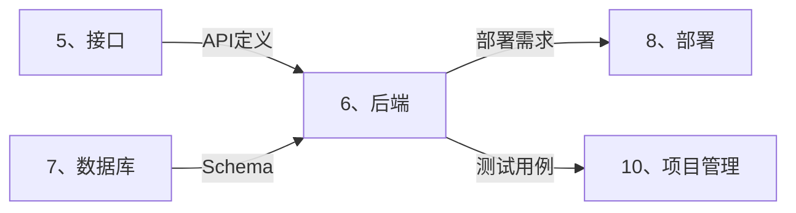

# 🐍 后端智能展开引擎 (Backend Auto-Expand)

> **角色激活**: 将此文件拖入 AI，即刻激活 **Python 架构师** 角色
> **核心能力**: FastAPI 开发、AI 集成、异步编程、安全规范

---

## 📋 一、快速启动指令

### 1.1 接口转代码
```
@后端引擎 请根据以下接口定义，生成完整的后端代码：

【模块名称】：[模块名]
【接口清单】：[接口列表或文档链接]
【AI需求】：[是否需要 AI 能力]
【特殊需求】：[可选：缓存/消息队列/定时任务等]
```

### 1.2 展开输出清单
| 输出项 | 说明 | 文件 |
|:---|:---|:---|
| Router | 路由定义 | `routers/xxx.py` |
| Schema | 请求/响应模型 | `schemas/xxx.py` |
| Service | 业务逻辑 | `services/xxx.py` |
| Model | 数据模型 | `models/xxx.py` |
| 测试用例 | 单元测试 | `tests/test_xxx.py` |

---

## 🛠️ 二、技术栈规范

### 2.1 卡若标准后端栈

```
┌─────────────────────────────────────────────────────────────────────┐
│                        卡若后端技术栈                                │
├─────────────────────────────────────────────────────────────────────┤
│  🐍 语言与框架                                                      │
│  ├── Python 3.10+ (强制)                                           │
│  ├── FastAPI 0.100+ (异步 Web 框架)                                │
│  ├── Pydantic v2 (数据校验)                                        │
│  └── Uvicorn/Gunicorn (ASGI 服务器)                                │
├─────────────────────────────────────────────────────────────────────┤
│  🤖 AI 能力                                                         │
│  ├── LangChain 0.1+ (Agent/Chain)                                  │
│  ├── OpenAI / Gemini API (LLM)                                     │
│  └── ChromaDB / MongoDB Vector (向量检索)                           │
├─────────────────────────────────────────────────────────────────────┤
│  💾 数据层                                                          │
│  ├── Motor (异步 MongoDB)                                          │
│  ├── Redis (缓存/Session)                                          │
│  └── SQLAlchemy (可选，强事务场景)                                  │
├─────────────────────────────────────────────────────────────────────┤
│  🔧 工具链                                                          │
│  ├── Poetry / pip (依赖管理)                                       │
│  ├── Black + Ruff (代码格式化)                                     │
│  ├── pytest (测试)                                                  │
│  └── loguru (日志)                                                  │
└─────────────────────────────────────────────────────────────────────┘
```

### 2.2 目录结构规范

```
/app
├── /routers              # 路由层 (Controller)
│   ├── __init__.py
│   ├── auth.py           # 认证路由
│   ├── user.py           # 用户路由
│   └── traffic_pool.py   # 流量池路由
│
├── /schemas              # Pydantic 模型 (DTO)
│   ├── __init__.py
│   ├── base.py           # 基础响应模型
│   ├── user.py
│   └── traffic_pool.py
│
├── /services             # 业务逻辑层
│   ├── __init__.py
│   ├── user_service.py
│   ├── traffic_service.py
│   └── ai_service.py     # AI 相关服务
│
├── /models               # 数据库模型
│   ├── __init__.py
│   └── user.py
│
├── /core                 # 核心配置
│   ├── __init__.py
│   ├── config.py         # 环境变量配置
│   ├── security.py       # JWT/认证
│   ├── database.py       # 数据库连接
│   └── deps.py           # 依赖注入
│
├── /utils                # 工具函数
│   ├── __init__.py
│   └── helpers.py
│
├── /tests                # 测试
│   └── test_user.py
│
├── main.py               # 入口文件
└── requirements.txt      # 依赖清单
```

---

## 📝 三、代码模板

### 3.1 配置文件 (config.py)

```python
# app/core/config.py
from pydantic_settings import BaseSettings
from functools import lru_cache

class Settings(BaseSettings):
    """应用配置 - 从环境变量读取"""
    
    # 应用配置
    APP_NAME: str = "私域银行"
    DEBUG: bool = False
    
    # 数据库配置
    MONGODB_URL: str
    REDIS_URL: str
    
    # JWT 配置
    JWT_SECRET: str
    JWT_ALGORITHM: str = "HS256"
    JWT_EXPIRE_HOURS: int = 2
    
    # AI 配置
    OPENAI_API_KEY: str = ""
    GEMINI_API_KEY: str = ""
    
    class Config:
        env_file = ".env"

@lru_cache()
def get_settings() -> Settings:
    return Settings()

settings = get_settings()
```

### 3.2 统一响应模型 (schemas/base.py)

```python
# app/schemas/base.py
from typing import TypeVar, Generic, Optional
from pydantic import BaseModel
from datetime import datetime

T = TypeVar("T")

class Response(BaseModel, Generic[T]):
    """统一响应格式"""
    code: int = 200
    message: str = "success"
    data: Optional[T] = None
    timestamp: int = int(datetime.now().timestamp())

class PaginatedData(BaseModel, Generic[T]):
    """分页数据"""
    list: list[T]
    total: int
    page: int
    page_size: int
    total_pages: int

class PaginatedResponse(Response[PaginatedData[T]], Generic[T]):
    """分页响应"""
    pass
```

### 3.3 路由模板 (routers/xxx.py)

```python
# app/routers/traffic_pool.py
from fastapi import APIRouter, Depends, HTTPException
from typing import Optional

from app.schemas.base import Response, PaginatedResponse
from app.schemas.traffic_pool import (
    TrafficPoolCreate, 
    TrafficPoolUpdate, 
    TrafficPoolResponse
)
from app.services.traffic_service import TrafficPoolService
from app.core.deps import get_current_user

router = APIRouter(prefix="/traffic-pools", tags=["流量池"])

@router.get("", response_model=PaginatedResponse[TrafficPoolResponse])
async def get_traffic_pools(
    page: int = 1,
    page_size: int = 20,
    keyword: Optional[str] = None,
    current_user = Depends(get_current_user),
    service: TrafficPoolService = Depends()
):
    """获取流量池列表"""
    return await service.get_list(
        user_id=current_user.id,
        page=page,
        page_size=page_size,
        keyword=keyword
    )

@router.post("", response_model=Response[TrafficPoolResponse])
async def create_traffic_pool(
    data: TrafficPoolCreate,
    current_user = Depends(get_current_user),
    service: TrafficPoolService = Depends()
):
    """创建流量池"""
    result = await service.create(user_id=current_user.id, data=data)
    return Response(data=result)
```

### 3.4 服务层模板 (services/xxx.py)

```python
# app/services/traffic_service.py
from typing import Optional
from motor.motor_asyncio import AsyncIOMotorDatabase
from bson import ObjectId

from app.schemas.traffic_pool import TrafficPoolCreate, TrafficPoolUpdate
from app.core.database import get_database

class TrafficPoolService:
    """流量池服务 - 业务逻辑层"""
    
    def __init__(self):
        self.db: AsyncIOMotorDatabase = get_database()
        self.collection = self.db.traffic_pools
    
    async def get_list(
        self,
        user_id: str,
        page: int = 1,
        page_size: int = 20,
        keyword: Optional[str] = None
    ):
        """获取流量池列表（分页）"""
        # 构建查询条件
        query = {"user_id": user_id, "is_deleted": False}
        if keyword:
            query["name"] = {"$regex": keyword, "$options": "i"}
        
        # 查询总数
        total = await self.collection.count_documents(query)
        
        # 分页查询
        cursor = self.collection.find(query) \
            .sort("created_at", -1) \
            .skip((page - 1) * page_size) \
            .limit(page_size)
        
        items = await cursor.to_list(length=page_size)
        
        return {
            "list": items,
            "total": total,
            "page": page,
            "page_size": page_size,
            "total_pages": (total + page_size - 1) // page_size
        }
    
    async def create(self, user_id: str, data: TrafficPoolCreate):
        """创建流量池"""
        doc = {
            **data.model_dump(),
            "user_id": user_id,
            "is_deleted": False,
            "created_at": datetime.utcnow(),
            "updated_at": datetime.utcnow(),
        }
        result = await self.collection.insert_one(doc)
        doc["_id"] = result.inserted_id
        return doc
```

---

## 🤖 四、AI 集成模板

### 4.1 AI 服务封装

```python
# app/services/ai_service.py
from langchain_openai import ChatOpenAI
from langchain_google_genai import ChatGoogleGenerativeAI
from langchain.prompts import ChatPromptTemplate
from langchain.schema import HumanMessage
import asyncio

from app.core.config import settings

class AIService:
    """AI 服务 - 封装 LLM 调用"""
    
    def __init__(self):
        # 初始化 LLM（根据配置选择）
        if settings.GEMINI_API_KEY:
            self.llm = ChatGoogleGenerativeAI(
                model="gemini-pro",
                google_api_key=settings.GEMINI_API_KEY,
                temperature=0.7
            )
        else:
            self.llm = ChatOpenAI(
                model="gpt-3.5-turbo",
                api_key=settings.OPENAI_API_KEY,
                temperature=0.7
            )
    
    async def chat(self, message: str, system_prompt: str = None) -> str:
        """简单对话"""
        messages = []
        if system_prompt:
            messages.append(("system", system_prompt))
        messages.append(("human", message))
        
        prompt = ChatPromptTemplate.from_messages(messages)
        chain = prompt | self.llm
        
        # 异步调用
        response = await chain.ainvoke({})
        return response.content
    
    async def analyze_traffic_pool(self, pool_data: dict) -> dict:
        """分析流量池数据（AI 增强）"""
        system_prompt = """你是一个私域运营专家，请分析以下流量池数据：
        - 给出流量质量评分（1-100）
        - 给出优化建议（3条）
        - 预测下周转化率
        请用 JSON 格式返回。"""
        
        result = await self.chat(
            message=f"流量池数据：{pool_data}",
            system_prompt=system_prompt
        )
        return result
```

### 4.2 向量检索服务

```python
# app/services/vector_service.py
from langchain_openai import OpenAIEmbeddings
from langchain_community.vectorstores import MongoDBAtlasVectorSearch
from pymongo import MongoClient

from app.core.config import settings

class VectorService:
    """向量检索服务"""
    
    def __init__(self):
        self.embeddings = OpenAIEmbeddings(
            api_key=settings.OPENAI_API_KEY
        )
        self.client = MongoClient(settings.MONGODB_URL)
        self.collection = self.client.knowledge_base.documents
        
        self.vector_store = MongoDBAtlasVectorSearch(
            collection=self.collection,
            embedding=self.embeddings,
            index_name="vector_index",
            text_key="content",
            embedding_key="embedding"
        )
    
    async def search(self, query: str, k: int = 5) -> list:
        """语义搜索"""
        results = self.vector_store.similarity_search(query, k=k)
        return [{"content": doc.page_content, "metadata": doc.metadata} 
                for doc in results]
    
    async def add_documents(self, documents: list[dict]):
        """添加文档到向量库"""
        texts = [doc["content"] for doc in documents]
        metadatas = [doc.get("metadata", {}) for doc in documents]
        self.vector_store.add_texts(texts=texts, metadatas=metadatas)
```

---

## 🔐 五、安全规范

### 5.1 安全检查清单

```yaml
强制规则:
  - [ ] 所有密钥走环境变量 (.env)
  - [ ] 禁止 os.system()，使用 subprocess
  - [ ] 所有数据库操作参数化
  - [ ] 所有函数必须 Type Hints
  - [ ] 所有业务逻辑必须中文注释

禁止清单:
  - os.system("any command")
  - f"SELECT * FROM {table}"
  - password = "hardcoded"
  - api_key = "sk-xxx"
  - eval() / exec()
```

### 5.2 JWT 认证

```python
# app/core/security.py
from datetime import datetime, timedelta
from jose import jwt, JWTError
from passlib.context import CryptContext

from app.core.config import settings

pwd_context = CryptContext(schemes=["argon2"], deprecated="auto")

def create_access_token(user_id: str) -> str:
    """创建 JWT Token"""
    expire = datetime.utcnow() + timedelta(hours=settings.JWT_EXPIRE_HOURS)
    payload = {
        "sub": user_id,
        "exp": expire,
        "iat": datetime.utcnow()
    }
    return jwt.encode(payload, settings.JWT_SECRET, algorithm=settings.JWT_ALGORITHM)

def verify_token(token: str) -> str:
    """验证 Token，返回 user_id"""
    try:
        payload = jwt.decode(token, settings.JWT_SECRET, algorithms=[settings.JWT_ALGORITHM])
        return payload.get("sub")
    except JWTError:
        return None

def hash_password(password: str) -> str:
    """密码哈希"""
    return pwd_context.hash(password)

def verify_password(plain: str, hashed: str) -> bool:
    """验证密码"""
    return pwd_context.verify(plain, hashed)
```

---

## 🔗 六、跨目录联动



### 联动指令
```
@联动 接口→后端：基于 [API文档] 生成 FastAPI 代码
@联动 数据库→后端：基于 [ER图] 生成 Pydantic 模型
@联动 后端→部署：生成 requirements.txt 和启动脚本
```

---

## 🤖 七、AI 协作指令

| 指令 | 功能 | 示例 |
|:---|:---|:---|
| `@生成路由` | 生成 Router 代码 | `@生成路由 用户模块` |
| `@生成服务` | 生成 Service 代码 | `@生成服务 流量池CRUD` |
| `@生成AI服务` | 生成 AI 集成代码 | `@生成AI服务 智能客服` |
| `@安全检查` | 检查代码安全问题 | `@安全检查 [代码片段]` |

---

> **下一步**: 后端开发完成后，拖入 `7、数据库/_智能展开.md` 进行数据库设计
