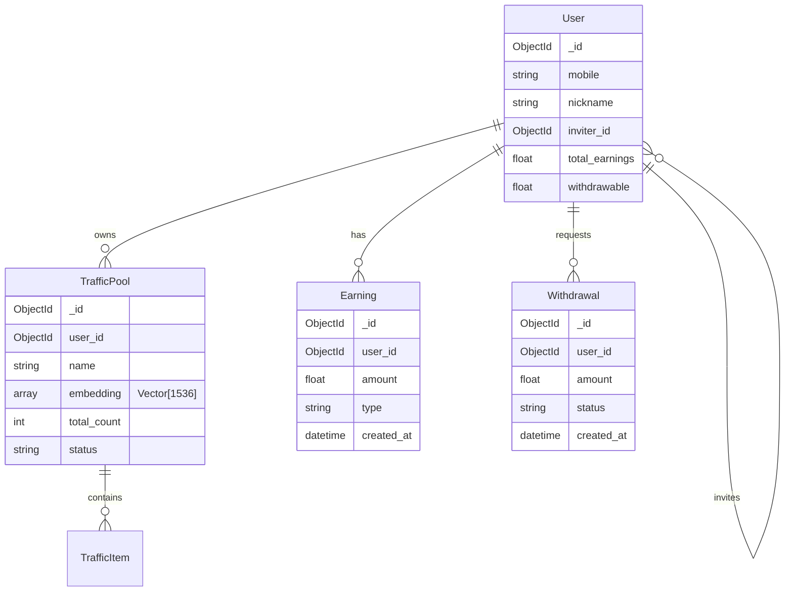
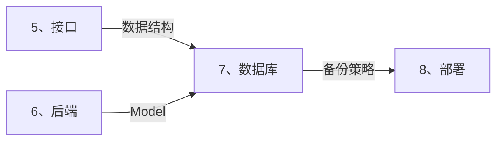

# 💾 数据库智能展开引擎 (Database Auto-Expand)

> **角色激活**: 将此文件拖入 AI，即刻激活 **DBA** 角色
> **核心能力**: MongoDB 设计、向量索引、ER 图、查询优化

---

## 📋 一、快速启动指令

### 1.1 需求转数据库
```
@数据库引擎 请根据以下需求，生成完整的数据库设计：

【模块名称】：[模块名]
【核心实体】：[主要数据对象]
【AI需求】：[是否需要向量检索]
【数据规模】：[预估数据量]
```

### 1.2 展开输出清单
| 输出项 | 说明 | 格式 |
|:---|:---|:---|
| ER 图 | 实体关系图 | Mermaid erDiagram |
| 集合设计 | MongoDB 集合结构 | JSON Schema |
| 索引策略 | 索引定义 | MongoDB 命令 |
| 向量配置 | 向量索引（如需） | Atlas 配置 |
| 查询示例 | 常用查询 | MongoDB 聚合 |

---

## 🛠️ 二、数据库选型

### 2.1 卡若数据库策略

```
┌─────────────────────────────────────────────────────────────────────┐
│                        数据库选型策略                                │
├─────────────────────────────────────────────────────────────────────┤
│  📦 MongoDB (首选)                                                  │
│  ├── 适用：业务数据、用户数据、日志数据                              │
│  ├── 优势：灵活 Schema、内置向量索引、JSON 原生                      │
│  └── 部署：Atlas 云服务 / 自建副本集                                │
├─────────────────────────────────────────────────────────────────────┤
│  🔍 向量能力                                                        │
│  ├── MongoDB Atlas Vector Search (推荐)                            │
│  ├── ChromaDB (轻量本地)                                            │
│  └── Pinecone (大规模云端)                                          │
├─────────────────────────────────────────────────────────────────────┤
│  💰 MySQL (可选)                                                    │
│  ├── 适用：强事务场景（资金流水、订单）                              │
│  └── 部署：腾讯云 CDB                                               │
├─────────────────────────────────────────────────────────────────────┤
│  ⚡ Redis                                                           │
│  ├── 适用：缓存、Session、限流计数                                   │
│  └── 部署：云 Redis / 自建                                          │
└─────────────────────────────────────────────────────────────────────┘
```

---

## 📊 三、集合设计规范

### 3.1 命名规范

```yaml
集合命名:
  格式: 复数、小写、下划线分隔
  示例: 
    ✅ users, traffic_pools, order_records
    ❌ User, trafficPool, OrderRecord

字段命名:
  格式: 小写、下划线分隔
  示例:
    ✅ user_id, created_at, is_deleted
    ❌ userId, createdAt, isDeleted

特殊字段:
  _id: 主键（MongoDB 自动生成）
  created_at: 创建时间
  updated_at: 更新时间
  is_deleted: 软删除标记
```

### 3.2 核心集合模板

#### users (用户表)
```javascript
{
  _id: ObjectId,
  mobile: "15880802661",           // 手机号（加密存储）
  password_hash: "xxx",            // 密码哈希
  nickname: "卡若",
  avatar: "https://...",
  role: "user",                    // user/admin/partner
  status: "active",                // active/disabled
  
  // 云阿米巴字段
  inviter_id: ObjectId,            // 邀请人 ID
  team_count: 0,                   // 团队人数
  total_earnings: 0.00,            // 累计收益
  withdrawable: 0.00,              // 可提现金额
  
  // 元数据
  created_at: ISODate,
  updated_at: ISODate,
  last_login_at: ISODate,
  is_deleted: false
}

// 索引
db.users.createIndex({ mobile: 1 }, { unique: true })
db.users.createIndex({ inviter_id: 1 })
db.users.createIndex({ created_at: -1 })
```

#### traffic_pools (流量池)
```javascript
{
  _id: ObjectId,
  user_id: ObjectId,               // 所属用户
  name: "抖音本地生活",
  description: "厦门本地餐饮流量",
  
  // 统计数据
  total_count: 1234,               // 总流量数
  today_count: 56,                 // 今日新增
  conversion_rate: 0.05,           // 转化率
  
  // 向量字段（AI 检索）
  embedding: [0.1, 0.2, ...],      // 1536 维向量
  
  // 状态
  status: "active",                // active/paused/deleted
  
  // 元数据
  created_at: ISODate,
  updated_at: ISODate,
  is_deleted: false
}

// 索引
db.traffic_pools.createIndex({ user_id: 1 })
db.traffic_pools.createIndex({ status: 1 })
db.traffic_pools.createIndex({ created_at: -1 })
```

#### earnings (收益记录)
```javascript
{
  _id: ObjectId,
  user_id: ObjectId,
  
  // 收益信息
  amount: 12.50,                   // 金额（精确到分）
  type: "order_commission",        // 收益类型
  source_id: ObjectId,             // 来源 ID
  source_type: "order",            // 来源类型
  
  // 描述
  description: "用户 A 下单佣金",
  
  // 元数据
  created_at: ISODate
}

// 索引
db.earnings.createIndex({ user_id: 1, created_at: -1 })
db.earnings.createIndex({ type: 1 })
```

---

## 🔍 四、向量索引配置

### 4.1 MongoDB Atlas Vector Search

```javascript
// 创建向量索引（Atlas UI 或 API）
{
  "mappings": {
    "dynamic": true,
    "fields": {
      "embedding": {
        "type": "knnVector",
        "dimensions": 1536,
        "similarity": "cosine"
      }
    }
  }
}
```

### 4.2 向量搜索查询

```javascript
// 语义搜索
db.knowledge_base.aggregate([
  {
    "$vectorSearch": {
      "index": "vector_index",
      "path": "embedding",
      "queryVector": [0.1, 0.2, ...],  // 查询向量
      "numCandidates": 100,
      "limit": 10
    }
  },
  {
    "$project": {
      "content": 1,
      "score": { "$meta": "vectorSearchScore" }
    }
  }
])
```

---

## 📈 五、常用查询模板

### 5.1 分页查询
```javascript
// 流量池列表（分页 + 搜索）
db.traffic_pools.aggregate([
  { $match: { user_id: ObjectId("xxx"), is_deleted: false } },
  { $match: { name: { $regex: "关键词", $options: "i" } } },
  { $sort: { created_at: -1 } },
  { $facet: {
      data: [{ $skip: 0 }, { $limit: 20 }],
      total: [{ $count: "count" }]
  }}
])
```

### 5.2 统计查询
```javascript
// 用户收益统计
db.earnings.aggregate([
  { $match: { user_id: ObjectId("xxx") } },
  { $group: {
      _id: null,
      today: { $sum: { $cond: [
        { $gte: ["$created_at", ISODate("今天")] },
        "$amount", 0
      ]}},
      this_month: { $sum: { $cond: [
        { $gte: ["$created_at", ISODate("本月1日")] },
        "$amount", 0
      ]}},
      total: { $sum: "$amount" }
  }}
])
```

---

## 📊 六、ER 图模板



---

## 🔗 七、跨目录联动



### 联动指令
```
@联动 接口→数据库：基于 [请求响应] 生成集合设计
@联动 数据库→后端：基于 [集合设计] 生成 Pydantic 模型
```

---

## 🤖 八、AI 协作指令

| 指令 | 功能 | 示例 |
|:---|:---|:---|
| `@生成集合` | 生成集合结构 | `@生成集合 订单模块` |
| `@生成ER图` | 生成关系图 | `@生成ER图 用户相关` |
| `@生成索引` | 生成索引策略 | `@生成索引 流量池集合` |
| `@生成查询` | 生成聚合查询 | `@生成查询 用户收益统计` |
| `@向量配置` | 生成向量索引 | `@向量配置 知识库` |

---

## ⚠️ 九、注意事项

### 9.1 安全规范
```yaml
必须做:
  - [ ] 敏感字段加密存储（手机号、身份证）
  - [ ] 密码必须 Hash（Argon2）
  - [ ] 所有查询参数化
  - [ ] 定期备份

禁止做:
  - [ ] 明文存储密码
  - [ ] 在日志中打印敏感数据
  - [ ] 直接拼接查询条件
```

### 9.2 性能优化
```yaml
索引原则:
  - 查询字段必建索引
  - 复合索引注意顺序
  - 避免过多索引

查询优化:
  - 避免 $where 和 $regex（无索引）
  - 大数据量用游标分批处理
  - 统计查询加缓存
```

---

> **下一步**: 数据库设计完成后，拖入 `8、部署/_智能展开.md` 进行部署配置
