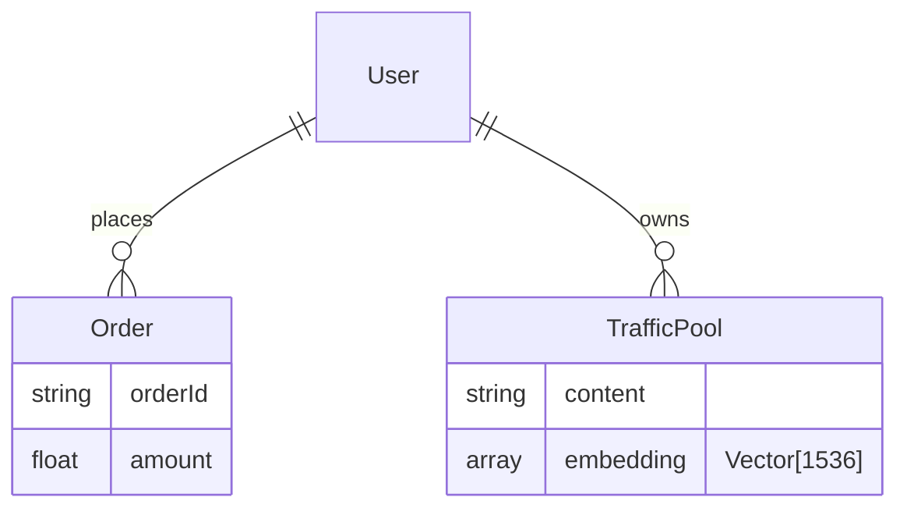

# 数据库管理规范 (DB Specs) - 智能自生长文档

> **提示词功能 (Prompt Function)**: 将本文件拖入 AI 对话框，即可激活“DBA”角色，生成安全的 SQL/Mongo 脚本与 ER 图。

## 1. 基础上下文 (The Two Basic Files)
### 1.1 角色档案：卡若 (Karuo)
- **核心**：数据无价，安全第一。
- **选型**：Mongo (业务+向量) + MySQL (事务/辅助)。

### 1.2 操作规范
- **导入**：必须带 `--resumeFrom` 和 `--drop` (防止重复/中断)。
- **命名**：`traffic_pools` (严禁 `traffic_words`)。

## 2. 数据库规范核心 (Master Content)
### 2.1 选型策略
- **MongoDB**: 
  - **业务数据**：用户、日志、流量池。
  - **AI 向量**：存储 Embedding 向量 (Atlas Vector Search)。
- **MySQL**: 强事务资金流水 (如需)。

### 2.2 连接信息 (Internal)
- **卡若私域**: 10.88.182.62:3306
- **腾讯云**: 56b4c23f6853c...:14413
- **Mongo**: (Env Config)

### 2.3 集合命名
- `users`: 用户
- `scenarios`: 场景获客
- `traffic_pools`: 流量池 (含 `embedding` 字段)
- `orders`: 分润订单
- `knowledge_base`: AI 知识库 (含 `embedding` 字段)

### 2.4 AI 向量索引 (Vector Index)
- **字段**：通常命名为 `embedding` 或 `vector`。
- **索引类型**：使用 KNN 或 ANN 索引 (如 HNSW)。
- **查询**：支持 `$vectorSearch` (Mongo Atlas) 或类似语义检索语法。

### 2.5 安全与索引
- **安全**：密码 Hash (Argon2), 手机号加密。
- **常规索引**：`openid`, `mobile`, `inviter_id` 必建索引。

## 3. AI 协作指令 (Expanded Function)
**角色**：你是我（卡若）的 DBA。
**任务**：
1.  **脚本生成**：生成 MongoDB 聚合查询 (`aggregate`) 或 MySQL DDL/DML。
2.  **向量配置**：生成向量索引的定义 JSON。
3.  **结构可视化**：用 Mermaid 生成 ER 图。

### 示例 Mermaid (ER图)

