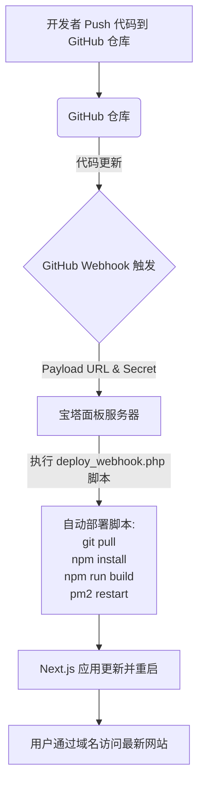
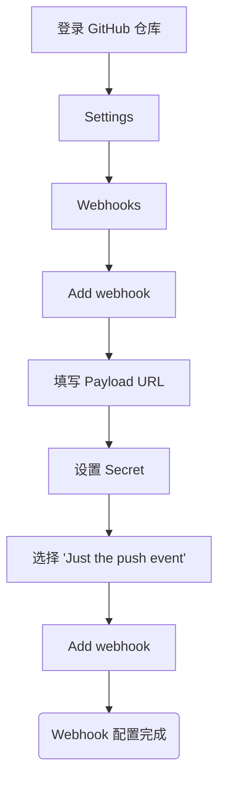
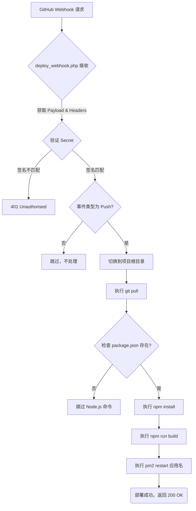

# Next.js 项目基于 GitHub Webhook 与宝塔面板的自动化部署流程文档

## I. 概述

本流程文档详细介绍了如何通过 GitHub 的 Webhook 功能与宝塔面板相结合，实现 Next.js 项目代码的自动化部署。当您向 GitHub 仓库提交代码后，服务器将自动拉取最新代码、安装依赖、构建项目并重启应用，从而实现持续集成与部署（CI/CD），极大地提升开发效率和部署的可靠性。

**核心理念：** 一次性配置宝塔面板的基础环境和网站，后续代码更新通过 GitHub Webhook 触发宝塔面板执行自动化部署脚本。

## II. 前提条件

在开始配置之前，请确保您已具备以下条件：

1.  **GitHub 账号**：并已拥有一个托管 Next.js 项目代码的仓库。
2.  **宝塔面板服务器**：一台已安装宝塔面板的 Linux 服务器。
3.  **已安装环境**：服务器上已通过宝塔面板的软件商店安装了 **Nginx (或 Apache)**、**Node.js (推荐 LTS 版本)** 和 **PM2 管理器**。
4.  **Git 环境**：服务器上已安装 Git（通常宝塔面板会自带或可通过软件商店安装）。
5.  **域名解析**：您的域名已正确解析到宝塔面板服务器的 IP 地址。

## III. 整体部署流程概览

以下是整个自动化部署流程的高层概览图：



## IV. 各环节详细流程与配置

### A. 阶段一：开发者本地代码提交与推送

这是您日常开发的工作流程。

```mermaid
graph TD
    A[开发者本地修改 Next.js 代码] --> B[git add];
    B --> C[git commit -m "更新了新功能"];
    C --> D[git push origin main];
    D --> E(代码推送到 GitHub 远程仓库);
```

**操作说明：**
您在本地完成 Next.js 项目开发后，通过标准的 Git 命令将代码提交并推送到 GitHub 仓库的指定分支（例如 `main` 或 `master`）。

### B. 阶段二：宝塔面板服务器环境与网站配置（由您手动完成，一次性）

这是实现自动化部署的基础，需要您在宝塔面板上进行一次性设置。

1.  **登录宝塔面板。**

2.  **安装 Node.js 和 PM2 管理器：**
    *   在宝塔面板左侧菜单选择 `软件商店`。
    *   搜索并安装 `Node.js` (推荐安装 LTS 版本，例如 16.x, 18.x, 20.x)。
    *   搜索并安装 `PM2 管理器`。PM2 是 Node.js 应用程序的生产级进程管理器，能确保您的 Next.js 应用在服务器上持续运行，并在代码更新后平滑重启。

3.  **创建网站与域名：**
    *   在宝塔面板左侧菜单选择 `网站` -> `添加站点`。
    *   填写您的**域名**（根据截图推测，可能是 `touzhi.quwanzhi.com` 或您实际绑定的域名）。
    *   `FTP` 和 `数据库` 可以选择不创建（如果您的 Next.js 项目是纯前端或后端分离的）。
    *   `PHP 版本` 选择 `纯静态`。
    *   `网站目录`：根据截图，您的项目可能在 `/www/wwwroot/tongzhi`。**请确认并记住这个目录。** 稍后它将是您的 Git 仓库克隆和 `deploy_webhook.php` 脚本存放的目录。
    *   点击 `提交`。

4.  **配置 Nginx 反向代理 Next.js 应用：**
    Next.js 应用通常运行在 Node.js 服务器上，并通过 Nginx 进行反向代理实现外网访问。
    *   在宝塔面板 `网站` 列表中，找到您刚刚创建的网站，点击右侧的 `设置`。
    *   切换到 `配置文件` 选项卡。
    *   在 `server` 配置块中，添加以下 `location` 配置（请将 `3000` 替换为 Next.js 应用实际监听的端口）：
        ```nginx
        # Nginx 配置示例 (添加到 server 段内)
        location / {
            proxy_pass http://127.0.0.1:3000; # <--- 替换为 PM2 启动的 Next.js 应用监听的实际端口
            proxy_http_version 1.1;
            proxy_set_header Upgrade $http_upgrade;
            proxy_set_header Connection "upgrade";
            proxy_set_header Host $host;
            proxy_cache_bypass $http_upgrade;
            # 如果您的 Next.js 应用有特殊路由需求，可能需要添加其他配置
        }
        ```
    *   点击 `保存`。

5.  **使用 PM2 管理 Next.js 应用：**
    *   在宝塔面板左侧菜单选择 `PM2管理器`。
    *   点击 `添加项目`。
    *   `项目目录`：选择您的网站根目录（根据截图可能是 `/www/wwwroot/tongzhi`）。
    *   `启动文件`：填写 `node_modules/next/dist/bin/next`。
    *   `项目名称`：根据截图，您的 PM2 项目名称可能是 `tongzhi` (**请务必记住这个名称，稍后在 Webhook 脚本中会用到**)。
    *   `启动参数`：填写 `start -p 3000` (这里的 `3000` 是您的 Next.js 应用监听的端口，请与 Nginx 反向代理中的端口保持一致)。
    *   点击 `提交`。
    *   PM2 会自动启动您的 Next.js 应用。您可以点击 `日志` 查看应用启动情况。

6.  **配置 Git 部署：**
    宝塔面板内置的 Git 部署功能是接收 GitHub Webhook 通知并触发部署脚本的关键。
    *   在宝塔面板 `网站` 列表中，找到对应的网站，点击右侧的 `设置`。
    *   在网站设置窗口中，找到 `Git` 选项卡，点击进入。
    *   勾选 `启用Git部署`。
    *   `平台` 选择 `Github`。
    *   `项目地址`：填写您的 GitHub 仓库的 HTTPS 地址。例如：`https://github.com/fnvtk/wztouzhi.git`。
    *   `分支`：填写您希望自动部署的分支名称，通常是 `main` 或 `master`。
    *   `Token`：**设置一个随机且复杂的字符串作为密钥**，例如 `your_custom_deploy_secret_wztouzhi_bt`。请务必牢记这个密钥，稍后在 GitHub Webhook 配置和部署脚本中会用到。
    *   `项目部署目录`：宝塔会自动填写网站的根目录（例如 `/www/wwwroot/tongzhi`），请确保它是您项目代码实际要部署的路径。
    *   `部署类型`：选择 `拉取`。
    *   **重要：`部署完成后执行的命令`：这里暂时留空，您将在后续步骤中将我为您生成的脚本内容粘贴到此处。**
    *   **获取 WebHook 地址：** 配置完上述信息并点击 `保存` 后，宝塔面板会为您生成一个 `WebHook地址`。**复制这个 URL！**

### C. 阶段三：GitHub 仓库 Webhook 配置（由您手动完成，一次性）

这个配置将使得 GitHub 在您推送代码时通知宝塔面板。



**操作说明：**
1.  **登录 GitHub**，进入您的 `wztouzhi` 项目仓库。
2.  点击仓库顶部的 `Settings`（设置）。
3.  在左侧导航栏中，点击 `Webhooks`。
4.  点击 `Add webhook`（添加 Webhook）。
5.  填写以下信息：
    *   **Payload URL**：粘贴您在宝塔面板 Git 部署设置中复制的 `WebHook地址`。
    *   **Content type**：选择 `application/json`。
    *   **Secret (可选，但强烈推荐)**：粘贴您在宝塔面板 Git 部署中设置的 `Token` (那个强密码)。
    *   **Which events would you like to trigger this webhook?**：选择 `Just the push event.`（仅推送事件）。
    *   `Active`：确保此选项被勾选。
6.  点击 `Add webhook` 完成添加。

### D. 阶段四：自动化部署脚本 `deploy_webhook.php` （由我提供，您粘贴到宝塔）

为了实现自动化构建和重启 Next.js 应用，我们需要一个 PHP 脚本来作为宝塔面板 Git 部署的"部署完成后执行的命令"。

我为您生成了以下 `deploy_webhook.php` 脚本。**您需要将此脚本的内容复制，并粘贴到宝塔面板网站设置中 Git 部署的"部署完成后执行的命令"文本框内。**

**脚本内容（已根据您的截图信息优化，请务必根据您的实际情况修改 `SECRET`）：**

```php
<?php
// deploy_webhook.php
// GitHub Webhook for Next.js (React) project deployment on Baota Panel

// --- 安全配置 ---
// 建议在宝塔面板的环境变量中设置此密钥，或者从配置文件读取，避免直接硬编码
$SECRET = 'your_deploy_secret_wztouzhi_bt'; // **请替换为你在宝塔面板Git部署中设置的Token**
$PROJECT_ROOT = '/www/wwwroot/tongzhi'; // **已根据截图更新为 `/www/wwwroot/tongzhi`**
$LOG_FILE = $PROJECT_ROOT . '/deploy.log'; // 部署日志文件，用于记录部署过程

// --- 函数定义 ---
function log_message($message) {
    global $LOG_FILE;
    file_put_contents($LOG_FILE, date('[Y-m-d H:i:s]') . ' ' . $message . PHP_EOL, FILE_APPEND);
}

function verify_signature($payload, $signature, $secret) {
    $hash = 'sha1=' . hash_hmac('sha1', $payload, $secret);
    return hash_equals($signature, $hash);
}

// --- 请求处理 ---
log_message('Webhook triggered.');

// 获取 GitHub 请求头
$github_signature = $_SERVER['HTTP_X_HUB_SIGNATURE'] ?? '';
$github_event = $_SERVER['HTTP_X_GITHUB_EVENT'] ?? '';
$payload = file_get_contents('php://input');

// 验证 Secret
if (empty($github_signature) || !verify_signature($payload, $github_signature, $SECRET)) {
    log_message('Invalid signature. Aborting deployment.');
    http_response_code(401);
    die('Invalid signature');
}

log_message("GitHub Event: {$github_event}");

// 只处理 push 事件
if ($github_event === 'push') {
    log_message('Processing push event...');

    // 切换到项目根目录
    chdir($PROJECT_ROOT);
    log_message("Changed directory to: " . getcwd());

    // 执行 Git Pull
    log_message('Executing git pull...');
    $output = shell_exec('git pull 2>&1');
    log_message("Git Pull Output:\n" . $output);

    // 检查 Next.js 项目文件 (package.json)
    if (file_exists('package.json')) {
        log_message('Detected Next.js project. Installing dependencies and building...');

        // 安装 Node.js 依赖
        log_message('Executing npm install...');
        // 使用 --force 强制安装，避免因包版本冲突导致安装失败
        $output = shell_exec('npm install --force 2>&1');
        log_message("npm install Output:\n" . $output);

        // 构建 Next.js 项目
        log_message('Executing npm run build...');
        $output = shell_exec('npm run build 2>&1');
        log_message("npm run build Output:\n" . $output);

        // 重启 PM2 进程 (已根据截图更新应用名为 'tongzhi')
        $PM2_APP_NAME = 'tongzhi'; // **已根据截图更新：请替换为你在PM2管理器中设置的项目名称**
        log_message("Restarting PM2 process '{$PM2_APP_NAME}'...");
        $output = shell_exec("pm2 restart {$PM2_APP_NAME} 2>&1");
        log_message("PM2 Restart Output:\n" . $output);

    } else {
        log_message('No package.json found. Skipping Node.js specific commands.');
    }

    log_message('Deployment completed.');
    echo 'Deployment successful!';

} else {
    log_message('Event not supported. Only "push" events are processed.');
    echo 'Event not supported.';
}

http_response_code(200);
?>
```

**脚本流程图：**



### V. 自动化部署完成与验证

完成以上所有配置后，每次您向 GitHub 仓库的指定分支推送代码，就会自动触发部署流程：

1.  GitHub 发送 Webhook 请求到宝塔面板。
2.  宝塔面板接收请求并执行 `deploy_webhook.php` 脚本。
3.  脚本在服务器上拉取最新代码，安装/更新 Node.js 依赖，构建 Next.js 项目。
4.  PM2 自动重启您的 Next.js 应用。
5.  您的网站内容更新，并能通过您绑定的域名在外网访问到最新版本。

**验证方法：**
*   **查看 GitHub Webhook 记录：** 在 GitHub 仓库的 Webhook 设置页面，查看 `Recent Deliveries`，确保每次推送都有成功的绿色勾选。
*   **查看宝塔面板 Git 部署日志：** 在宝塔面板网站设置的 `Git` 选项卡中，通常会有部署日志，可以查看详细的执行情况。
*   **查看 `deploy.log` 文件：** 脚本会在项目根目录生成 `deploy.log` 文件，记录每次部署的详细信息，方便排查问题。
*   **访问您的网站：** 通过域名访问您的网站，确认内容是否已更新到最新。

### VI. 注意事项与优化

*   **安全性**：`Secret` 密钥是关键，请妥善保管，不要泄露。
*   **权限问题**：确保宝塔面板运行的用户（通常是 `www` 用户）对项目目录有足够的读写权限，以便 `git pull`、`npm install`、`npm run build` 等命令能够正常执行。
*   **依赖缓存**：在部署脚本中，`npm install` 会在每次部署时运行。如果您的项目依赖较多，可以考虑在 `Dockerfile` 中构建一个包含依赖的镜像，或者在服务器上对 `node_modules` 进行缓存处理，以加快部署速度（此文档以直接安装为默认）。
*   **错误处理**：脚本中已加入了日志记录，您可以通过查看 `deploy.log` 文件来排查部署失败的原因。
*   **生产模式**：确保您的 Next.js 应用在 `npm run build` 后是以生产模式构建的。
*   **持续学习**：自动化部署是一个持续优化的过程，您可以根据项目需求和服务器性能，不断调整部署脚本。 