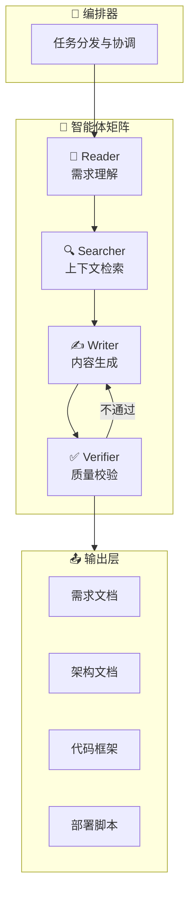

# 🚀 AI 开发引擎 (AI Development Engine) v2.0

> **核心定位**: 这是整个开发模板的"大脑"，一个基于多智能体协作的智能开发中台。
> **使用方式**: 将此文件拖入 AI 对话框，即可激活"全栈架构师"角色，自动拆解项目并联动所有目录。

---

## 🎯 引擎功能矩阵

```
┌─────────────────────────────────────────────────────────────────────────┐
│                         AI 开发引擎 (总控)                               │
├─────────────────────────────────────────────────────────────────────────┤
│  📥 输入层          │  🧠 处理层           │  📤 输出层                 │
│  ─────────────      │  ─────────────       │  ─────────────            │
│  · 需求描述         │  · 需求拆解引擎      │  · 完整项目文档            │
│  · 竞品/截图        │  · 架构设计引擎      │  · 代码框架                │
│  · 预算/时间        │  · 代码生成引擎      │  · 部署脚本                │
│                     │  · 文档生成引擎      │  · 使用手册                │
└─────────────────────────────────────────────────────────────────────────┘
```

---

## 🏗️ 一、快速启动：一键展开项目

### 1.1 极速启动指令
将以下内容复制到 AI 对话框，替换 `[项目描述]` 即可自动展开整个项目：

```
@AI引擎 请根据以下需求，自动展开完整项目文档：

【项目名称】：[填写项目名]
【核心功能】：[用一句话描述核心功能]
【目标用户】：[谁会用这个产品]
【预期规模】：[日活/并发/数据量]
【时间预算】：[开发周期]
【技术偏好】：[有无特定技术栈要求]

请按照 1-10 目录结构，逐一生成所有文档。
```

### 1.2 展开输出清单
AI 将自动生成以下全套文档：

| 序号 | 目录 | 自动生成内容 | 联动文件 |
|:---:|:---|:---|:---|
| 1 | 需求 | 业务流程图、用户故事、MVP 功能清单 | `业务需求.md` `成本.md` |
| 2 | 架构 | 系统架构图、技术选型表、模块拆分 | `系统架构.md` `技术选型.md` |
| 3 | 原型 | 页面结构、交互流程、UI 规范 | `原型设计规范.md` |
| 4 | 前端 | 组件树、页面代码、样式系统 | `前端开发规范.md` |
| 5 | 接口 | API 列表、请求响应示例、错误码 | `接口定义规范.md` |
| 6 | 后端 | 服务拆分、业务流程、AI 集成 | `后端开发规范.md` |
| 7 | 数据库 | ER 图、集合设计、索引策略 | `数据库管理规范.md` |
| 8 | 部署 | 部署脚本、CI/CD 配置、运维手册 | `项目程序提示词.md` |
| 9 | 手册 | 用户手册、FAQ、营销文案 | `使用手册提示词.md` |
| 10 | 管理 | 甘特图、执行表、风险矩阵 | `项目管理提示词.md` |

---

## 🧠 二、多智能体协作架构 (DocAgent)

基于最新 AI 研究成果，本引擎采用多智能体协作模式：



### 智能体职责说明

| 智能体 | 角色 | 职责 | 对应目录 |
|:---:|:---|:---|:---|
| 📖 Reader | 需求分析师 | 理解输入、提取关键信息 | 1、需求 |
| 🔍 Searcher | 架构师 | 检索最佳实践、技术选型 | 2、架构 |
| ✍️ Writer | 全栈工程师 | 生成代码、文档、配置 | 3-8 目录 |
| ✅ Verifier | QA 工程师 | 校验一致性、安全性 | 9、10 目录 |

---

## ⚡ 三、智能展开指令集

### 3.1 按阶段展开

```
# 阶段一：需求与架构（战略层）
@AI引擎 展开阶段一：
- 生成业务流程图 (Mermaid)
- 生成用户故事卡片
- 生成技术选型对比表
- 生成系统架构图

# 阶段二：设计与接口（战术层）
@AI引擎 展开阶段二：
- 生成页面结构树
- 生成 API 接口文档
- 生成 ER 图
- 生成组件设计图

# 阶段三：编码与部署（执行层）
@AI引擎 展开阶段三：
- 生成前端代码框架
- 生成后端代码框架
- 生成部署脚本
- 生成运维手册
```

### 3.2 按目录单独展开

```
# 单独展开某个目录
@AI引擎 展开目录[N]：[项目上下文]

# 示例：
@AI引擎 展开目录5：为私域银行项目生成完整 API 接口文档
```

### 3.3 跨目录联动展开

```
# 联动展开（自动保持一致性）
@AI引擎 联动展开：
- 基于 [需求文档] 更新 [架构文档]
- 基于 [架构文档] 生成 [接口文档]
- 基于 [接口文档] 生成 [前端代码]
- 基于 [接口文档] 生成 [后端代码]
```

---

## 🔧 四、核心规则与约束

### 4.1 卡若风格规则

```yaml
# 输出风格
语言: 大白话，直击要点
结构: 结论→原因→步骤
可视化: 必须包含 Mermaid 图表
代码: 必须中文注释

# 技术规范
前端: React + Shadcn UI + Tailwind CSS + iOS 风格
后端: Python FastAPI + Type Hints + 异步优先
数据库: MongoDB 优先（含向量索引）
部署: Webhook 自动化 + 宝塔/Docker

# 安全规范
禁止: 硬编码密钥、os.system()、rm -rf
强制: 参数化查询、Type Hints、骨架屏
```

### 4.2 云阿米巴商业规则

```yaml
# 核心逻辑
分钱原则: 分不属于对方的钱
价值绑定: 按创造价值分钱
流量锁定: 用稳定流量 + 便捷私域体系绑定合作方

# 产品规则
流量池: 页面必须有流量入口
分润显示: 让合作方一眼看到赚了多少钱
一键提现: 降低操作门槛
```

---

## 📊 五、输出模板库

### 5.1 需求文档模板

```markdown
# [项目名称] 需求文档 v1.0

## 一、项目背景
[为什么做这个项目？解决什么痛点？]

## 二、目标用户
| 用户角色 | 核心诉求 | 使用场景 |
|:---|:---|:---|

## 三、功能清单 (MVP)
| 功能模块 | 子功能 | 优先级 | 验收标准 |
|:---|:---|:---:|:---|

## 四、业务流程
[Mermaid 流程图]

## 五、成功指标
- [ ] 核心指标 1
- [ ] 核心指标 2
```

### 5.2 架构文档模板

```markdown
# [项目名称] 系统架构 v1.0

## 一、技术选型
| 层级 | 技术 | 选型理由 |
|:---|:---|:---|

## 二、系统架构图
[Mermaid C4/架构图]

## 三、模块拆分
| 模块 | 职责 | 依赖 |
|:---|:---|:---|

## 四、数据流
[Mermaid 序列图]
```

### 5.3 API 文档模板

```markdown
# [项目名称] API 文档 v1.0

## 接口：[接口名称]
- **URL**: `/api/v1/xxx`
- **Method**: `POST`
- **Auth**: Bearer Token

### Request
| 参数 | 类型 | 必填 | 说明 |
|:---|:---|:---:|:---|

### Response
{
  "code": 200,
  "message": "success",
  "data": { }
}

### 错误码
| code | message | 处理建议 |
|:---:|:---|:---|
```

---

## 🔄 六、自动更新机制

### 6.1 文档同步规则

```
触发条件 → 自动更新动作
─────────────────────────
需求变更 → 更新架构文档、接口文档、前后端代码
接口变更 → 更新前端调用、后端实现、API 文档
数据库变更 → 更新 ER 图、后端 Model、接口文档
部署配置变更 → 更新运维手册、启动脚本
```

### 6.2 版本控制

```yaml
# 文档版本规则
major.minor.patch
  │     │     └── 小修小补（错别字、格式）
  │     └──────── 功能迭代（新增接口、字段）
  └────────────── 架构变更（技术栈、模块重构）
```

---

## 🎮 七、快捷指令速查表

| 指令 | 功能 | 示例 |
|:---|:---|:---|
| `@全量展开` | 展开所有 1-10 目录 | `@全量展开 私域银行项目` |
| `@展开[N]` | 展开指定目录 | `@展开5 生成 API 文档` |
| `@联动更新` | 基于变更同步文档 | `@联动更新 接口新增了 /api/v1/withdraw` |
| `@生成代码` | 生成代码框架 | `@生成代码 前端登录页面` |
| `@生成图表` | 生成 Mermaid 图 | `@生成图表 用户下单流程` |
| `@复盘总结` | 生成项目复盘 | `@复盘总结 Q1 迭代` |

---

## 📎 附录：目录索引

| 目录 | 智能展开文件 | 角色 |
|:---|:---|:---|
| 1、需求 | `_智能展开.md` | CFO + 产品负责人 |
| 2、架构 | `_智能展开.md` | CTO + 架构师 |
| 3、原型 | `_智能展开.md` | UI/UX 设计师 |
| 4、前端 | `_智能展开.md` | 前端主程 |
| 5、接口 | `_智能展开.md` | API 架构师 |
| 6、后端 | `_智能展开.md` | Python 架构师 |
| 7、数据库 | `_智能展开.md` | DBA |
| 8、部署 | `_智能展开.md` | DevOps 运维 |
| 9、手册 | `_智能展开.md` | 技术文档专家 |
| 10、项目管理 | `_智能展开.md` | 高级 PM |

---

> **使用提示**: 本文件是"总控"，每个目录下的 `_智能展开.md` 是"分控"。可以单独使用某个目录的智能展开，也可以用本文件一键展开全部。
