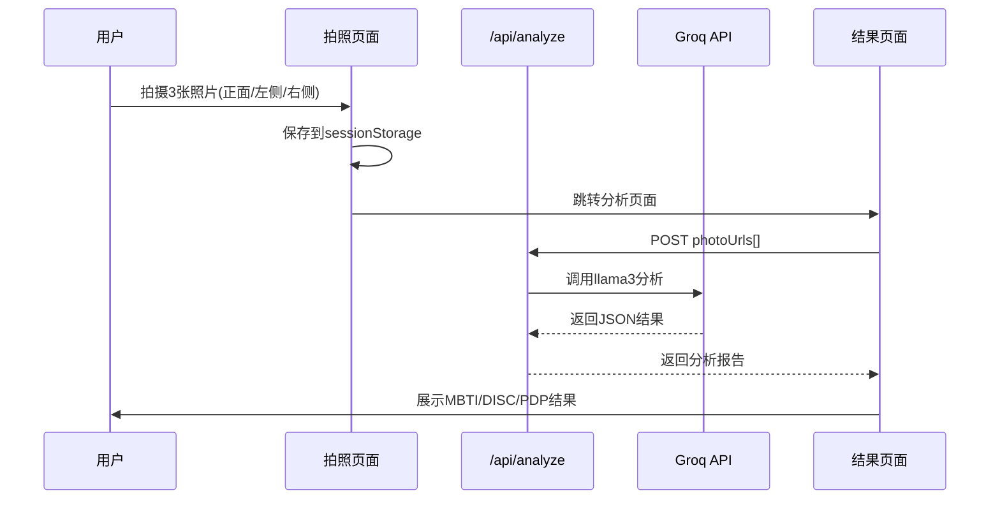

# 🤖 AI功能核心代码提取

> **功能**: AI人脸性格分析  
> **核心文件**: `lib/groq-service.ts` + `app/api/analyze/route.ts`  
> **AI服务**: Groq API (llama3-8b-8192)

---

## 一、AI分析流程



---

## 二、核心代码：Groq服务 (lib/groq-service.ts)

```typescript
// ========================================
// 文件: lib/groq-service.ts
// 作用: 调用Groq API进行AI面相分析
// 核心要点:
//   1. 使用llama3-8b-8192模型（快速、低成本）
//   2. 强制JSON格式输出
//   3. 8秒超时保护
//   4. 失败时返回模拟数据保证体验
// ========================================

export async function analyzePhotosWithGroq(photoUrls: string[]): Promise<any> {
  try {
    // 检查API密钥
    if (!process.env.GROQ_API_KEY) {
      return {
        code: 1,
        message: "Groq API密钥未配置",
        data: getMockAnalysisResult(),
      }
    }

    // 优化的提示词（要求JSON格式）
    const prompt = `
作为面相分析专家，请基于用户面部照片生成简短性格分析报告。

严格按照以下JSON格式返回，不要添加任何其他文本：
{
  "overview": "整体性格概述（50字左右）",
  "mbti": {
    "type": "MBTI类型（如ENTJ）",
    "title": "MBTI类型中文名称",
    "dimensions": {
      "energy": "外向/内向分析（简短）",
      "information": "感觉/直觉分析（简短）",
      "decisions": "思考/情感分析（简短）",
      "lifestyle": "判断/感知分析（简短）"
    }
  },
  "pdp": {
    "primary": "主要PDP类型（老虎/孔雀/无尾熊/猫头鹰/变色龙）",
    "secondary": "辅助PDP类型",
    "description": "PDP类型描述（简短）"
  },
  "disc": {
    "primary": "主要DISC类型（D/I/S/C）",
    "secondary": "辅助DISC类型",
    "description": "DISC类型描述（简短）"
  },
  "facialExpressions": {
    "overall": "整体面部表情分析（简短）",
    "emotions": ["主要情绪1", "主要情绪2", "主要情绪3"]
  }
}
只返回JSON对象，不要添加任何前缀或解释。
`

    // 8秒超时保护
    return await Promise.race([
      callGroqWithFetch(prompt),
      new Promise((_, reject) => 
        setTimeout(() => reject(new Error("Groq API调用超时")), 8000)
      )
    ])
    
  } catch (error) {
    // 失败时返回模拟数据，保证用户体验
    return {
      code: 3,
      message: `Groq服务异常: ${(error as Error).message}`,
      data: getMockAnalysisResult(),
    }
  }
}

// 调用Groq API
async function callGroqWithFetch(prompt: string): Promise<any> {
  const response = await fetch("https://api.groq.com/openai/v1/chat/completions", {
    method: "POST",
    headers: {
      "Content-Type": "application/json",
      Authorization: `Bearer ${process.env.GROQ_API_KEY}`,
    },
    body: JSON.stringify({
      model: "llama3-8b-8192",           // 快速模型
      messages: [
        {
          role: "system",
          content: "你是一个JSON响应助手。你只返回有效的JSON，不添加任何其他文本。",
        },
        { role: "user", content: prompt },
      ],
      temperature: 0.3,                   // 低温度=更稳定
      max_tokens: 800,                    // 限制token
      response_format: { type: "json_object" },  // 强制JSON
    }),
  })

  const data = await response.json()
  const content = data.choices[0]?.message?.content || ""
  
  return {
    code: 0,
    data: JSON.parse(content),
  }
}

// 模拟分析结果（API失败时的降级方案）
function getMockAnalysisResult() {
  return {
    overview: "基于面部特征分析，您展现出外向、善于思考的特质...",
    mbti: {
      type: "ENTJ",
      title: "指挥官型人格",
      dimensions: { /* ... */ },
    },
    pdp: { primary: "老虎", secondary: "孔雀", /* ... */ },
    disc: { primary: "D型(支配型)", secondary: "I型(影响型)", /* ... */ },
    facialExpressions: { overall: "...", emotions: ["自信", "专注", "亲和"] },
    resultId: `result_${Date.now()}_${Math.random().toString(36).substring(2, 9)}`,
  }
}
```

---

## 三、核心代码：API路由 (app/api/analyze/route.ts)

```typescript
// ========================================
// 文件: app/api/analyze/route.ts
// 作用: AI分析接口，接收照片URL，返回分析结果
// 核心要点:
//   1. 接收photoUrls数组
//   2. 调用Groq服务分析
//   3. 保存结果到MongoDB
//   4. 10秒超时保护
// ========================================

import { type NextRequest, NextResponse } from "next/server"
import { analyzePhotosWithGroq } from "@/lib/groq-service"
import { getDatabase } from "@/lib/database"

export async function POST(request: NextRequest) {
  try {
    // 1. 解析请求
    const body = await request.json()
    const photoUrls = body.photoUrls || []
    const userId = body.userId || null

    // 2. 验证输入
    if (!photoUrls || !Array.isArray(photoUrls) || photoUrls.length === 0) {
      return NextResponse.json({
        error: "无效的照片URL",
        code: 400,
        data: getMockAnalysisResult(),
      }, { status: 400 })
    }

    // 3. 调用AI分析（10秒超时）
    const analysisResult = await Promise.race([
      analyzePhotosWithGroq(photoUrls),
      new Promise((_, reject) => 
        setTimeout(() => reject(new Error("分析超时")), 10000)
      ),
    ])

    // 4. 保存到数据库（如果有用户ID）
    if (userId) {
      const db = getDatabase()
      const user = db.getUserById(userId)
      if (user) {
        user.testResults = user.testResults || []
        user.testResults.push({
          id: `result_${Date.now()}`,
          testType: "face",
          date: new Date().toISOString(),
          result: analysisResult.data,
        })
        db.updateUser(user)
      }
    }

    return NextResponse.json(analysisResult)
    
  } catch (error) {
    // 错误时返回模拟数据，确保前端能继续工作
    return NextResponse.json({
      error: `分析失败: ${(error as Error).message}`,
      code: 999,
      data: getMockAnalysisResult(),
    }, { status: 500 })
  }
}
```

---

## 四、前端调用示例

### 4.1 Web端调用 (app/analysis/page.tsx)

```tsx
// 从sessionStorage获取照片
const storedPhotos = sessionStorage.getItem("uploadedPhotoUrls")
const photoUrls = JSON.parse(storedPhotos)

// 调用分析接口
const response = await fetch('/api/analyze', {
  method: 'POST',
  headers: { 'Content-Type': 'application/json' },
  body: JSON.stringify({ photoUrls, userId }),
})

const result = await response.json()
// result.data 包含 mbti, pdp, disc, facialExpressions 等
```

### 4.2 小程序端调用 (miniprogram/pages/ai-test/result.js)

```javascript
// 模拟AI分析（小程序端目前使用本地模拟）
startAnalysis() {
  // 实际项目应调用后端API
  wx.request({
    url: `${app.globalData.apiBase}/api/analyze`,
    method: 'POST',
    data: {
      photoUrls: wx.getStorageSync('aiPhotos'),
      userId: app.globalData.openId
    },
    success: (res) => {
      this.setData({
        isAnalyzing: false,
        result: res.data.data
      })
    }
  })
}
```

---

## 五、环境变量配置

```bash
# .env.local

# Groq API密钥（必需）
GROQ_API_KEY=gsk_xxxxxxxxxxxxxxxx

# MongoDB连接（可选，用于保存结果）
MONGODB_URI=mongodb://localhost:27017/mbti

# 微信小程序配置
WECHAT_APP_ID=wx3d15ed02e98b04e3
WECHAT_APP_SECRET=a3ccdf829584b7f85143b68c4b6f7528
```

---

## 六、API成本估算

| 项目 | 数值 |
|:---|:---|
| **模型** | llama3-8b-8192 |
| **单次分析Token** | ~800 tokens |
| **Groq定价** | $0.05/1M input, $0.10/1M output |
| **单次成本** | 约 ¥0.001 (几乎免费) |

---

## 七、优化建议

1. **接入真实图像分析**: 当前Groq不支持图像，考虑接入：
   - **GPT-4 Vision**: 图像理解能力强，但成本高
   - **Claude 3**: 多模态支持，成本适中
   - **Gemini Pro Vision**: Google免费额度大

2. **添加缓存**: 相同照片不重复分析

3. **结果持久化**: 将分析结果保存到MongoDB

4. **错误重试**: 添加指数退避重试机制
