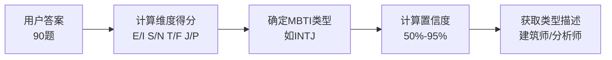

# 🧠 MBTI计算器核心代码

> **文件位置**: `lib/mbti-calculator.ts`  
> **核心功能**: 计算维度得分、确定MBTI类型、计算置信度

---

## 一、MBTI计算流程



---

## 二、核心算法代码

```typescript
// ========================================
// 文件: lib/mbti-calculator.ts
// 作用: MBTI测试核心计算算法
// 核心要点:
//   1. 四维度八方向得分统计
//   2. 加权计算（核心问题权重更高）
//   3. 置信度计算（差异越大越确定）
// ========================================

// 维度得分接口
export interface IDimensionScore {
  E: number; // 外向
  I: number; // 内向
  S: number; // 感觉
  N: number; // 直觉
  T: number; // 思考
  F: number; // 情感
  J: number; // 判断
  P: number; // 感知
}

// 测试答案接口
export interface ITestAnswer {
  questionId: number;
  selectedOption: string; // E/I, S/N, T/F, J/P
  dimension: string;      // EI, SN, TF, JP
}

// MBTI类型描述
export const MBTI_DESCRIPTIONS = {
  INTJ: { name: '建筑师', category: '分析师' },
  INTP: { name: '逻辑学家', category: '分析师' },
  ENTJ: { name: '指挥官', category: '分析师' },
  ENTP: { name: '辩论家', category: '分析师' },
  INFJ: { name: '提倡者', category: '外交官' },
  INFP: { name: '调停者', category: '外交官' },
  ENFJ: { name: '主人公', category: '外交官' },
  ENFP: { name: '竞选者', category: '外交官' },
  ISTJ: { name: '物流师', category: '守护者' },
  ISFJ: { name: '守卫者', category: '守护者' },
  ESTJ: { name: '总经理', category: '守护者' },
  ESFJ: { name: '执政官', category: '守护者' },
  ISTP: { name: '鉴赏家', category: '探险家' },
  ISFP: { name: '探险家', category: '探险家' },
  ESTP: { name: '企业家', category: '探险家' },
  ESFP: { name: '表演者', category: '探险家' }
};

/**
 * MBTI计算器类
 */
export class MBTICalculator {
  
  /**
   * 计算维度得分（核心算法）
   * @param answers 测试答案数组
   * @returns 标准化的维度得分 (0-100)
   */
  static calculateDimensionScores(answers: ITestAnswer[]): IDimensionScore {
    // 初始化得分
    const scores: IDimensionScore = {
      E: 0, I: 0, S: 0, N: 0,
      T: 0, F: 0, J: 0, P: 0
    };
    
    // 初始化权重总和
    const weightSums = { EI: 0, SN: 0, TF: 0, JP: 0 };
    
    // 遍历所有答案，累加得分
    answers.forEach(answer => {
      const { questionId, selectedOption, dimension } = answer;
      const weight = this.getQuestionWeight(questionId, dimension);
      
      scores[selectedOption as keyof IDimensionScore] += weight;
      weightSums[dimension as keyof typeof weightSums] += weight;
    });
    
    // 标准化到 0-100 范围
    return {
      E: weightSums.EI > 0 ? Math.round((scores.E / weightSums.EI) * 100) : 50,
      I: weightSums.EI > 0 ? Math.round((scores.I / weightSums.EI) * 100) : 50,
      S: weightSums.SN > 0 ? Math.round((scores.S / weightSums.SN) * 100) : 50,
      N: weightSums.SN > 0 ? Math.round((scores.N / weightSums.SN) * 100) : 50,
      T: weightSums.TF > 0 ? Math.round((scores.T / weightSums.TF) * 100) : 50,
      F: weightSums.TF > 0 ? Math.round((scores.F / weightSums.TF) * 100) : 50,
      J: weightSums.JP > 0 ? Math.round((scores.J / weightSums.JP) * 100) : 50,
      P: weightSums.JP > 0 ? Math.round((scores.P / weightSums.JP) * 100) : 50
    };
  }
  
  /**
   * 确定MBTI类型
   * @param scores 维度得分
   * @returns MBTI类型字符串 (如 "INTJ")
   */
  static determineMBTIType(scores: IDimensionScore): string {
    return [
      scores.E > scores.I ? 'E' : 'I',  // 能量来源
      scores.S > scores.N ? 'S' : 'N',  // 信息获取
      scores.T > scores.F ? 'T' : 'F',  // 决策方式
      scores.J > scores.P ? 'J' : 'P'   // 生活方式
    ].join('');
  }
  
  /**
   * 计算置信度
   * @param scores 维度得分
   * @returns 置信度 (50-95%)
   */
  static calculateConfidence(scores: IDimensionScore): number {
    // 计算每个维度的差异程度
    const differences = [
      Math.abs(scores.E - scores.I),
      Math.abs(scores.S - scores.N),
      Math.abs(scores.T - scores.F),
      Math.abs(scores.J - scores.P)
    ];
    
    // 平均差异 → 差异越大，置信度越高
    const avgDifference = differences.reduce((sum, diff) => sum + diff, 0) / 4;
    
    // 映射到 50%-95% 范围
    return Math.min(95, Math.max(50, 50 + avgDifference * 0.9));
  }
  
  /**
   * 完整计算流程（一键调用）
   */
  static calculateMBTIResult(answers: ITestAnswer[]) {
    const dimensionScores = this.calculateDimensionScores(answers);
    const mbtiType = this.determineMBTIType(dimensionScores);
    const confidence = this.calculateConfidence(dimensionScores);
    const description = this.getMBTIDescription(mbtiType);
    
    return {
      mbtiType,           // "INTJ"
      dimensionScores,    // { E: 35, I: 65, ... }
      confidence,         // 78
      description,        // { name: "建筑师", category: "分析师" }
      dominantDimensions: {
        energySource: dimensionScores.E > dimensionScores.I ? 'E' : 'I',
        informationGathering: dimensionScores.S > dimensionScores.N ? 'S' : 'N',
        decisionMaking: dimensionScores.T > dimensionScores.F ? 'T' : 'F',
        lifestyle: dimensionScores.J > dimensionScores.P ? 'J' : 'P'
      },
      dimensionStrengths: {
        EI: Math.abs(dimensionScores.E - dimensionScores.I),
        SN: Math.abs(dimensionScores.S - dimensionScores.N),
        TF: Math.abs(dimensionScores.T - dimensionScores.F),
        JP: Math.abs(dimensionScores.J - dimensionScores.P)
      }
    };
  }
}
```

---

## 三、前端简化调用

```typescript
// 在测试页面中使用
import { MBTICalculator } from '@/lib/mbti-calculator';

// 用户答完题后
const answers = {
  1: 'E', 2: 'I', 3: 'E', // ... 共90个
};

// 简化版计算（前端直接用）
const result = MBTICalculator.calculateFromSimpleAnswers(
  answers,           // { questionId: selectedOption }
  mbtiQuestions      // 题目数组
);

// result 包含:
// - mbtiType: "INTJ"
// - confidence: 78
// - dimensionScores: { E: 35, I: 65, S: 40, N: 60, T: 70, F: 30, J: 55, P: 45 }
// - description: { name: "建筑师", category: "分析师" }
```

---

## 四、MBTI四维度说明

| 维度 | 二分法 | 说明 |
|:---:|:---:|:---|
| **能量来源** | E 外向 / I 内向 | 从外部世界还是内心世界获取能量 |
| **信息获取** | S 感觉 / N 直觉 | 关注具体细节还是整体模式 |
| **决策方式** | T 思考 / F 情感 | 基于逻辑还是价值观做决定 |
| **生活方式** | J 判断 / P 感知 | 喜欢计划还是灵活应变 |

---

## 五、16种人格类型

| 类型 | 中文名 | 分类 | 特征 |
|:---:|:---:|:---:|:---|
| INTJ | 建筑师 | 分析师 | 战略思维、独立、追求完美 |
| INTP | 逻辑学家 | 分析师 | 理性分析、创新、求知欲强 |
| ENTJ | 指挥官 | 分析师 | 领导力强、果断、目标导向 |
| ENTP | 辩论家 | 分析师 | 机智、创新、喜欢挑战 |
| INFJ | 提倡者 | 外交官 | 有远见、理想主义、富有同情心 |
| INFP | 调停者 | 外交官 | 理想主义、善良、重视和谐 |
| ENFJ | 主人公 | 外交官 | 有魅力、利他、善于激励 |
| ENFP | 竞选者 | 外交官 | 热情、创意、善于社交 |
| ISTJ | 物流师 | 守护者 | 可靠、务实、注重细节 |
| ISFJ | 守卫者 | 守护者 | 温和、负责、乐于助人 |
| ESTJ | 总经理 | 守护者 | 组织力强、传统、讲效率 |
| ESFJ | 执政官 | 守护者 | 关心他人、和谐、忠诚 |
| ISTP | 鉴赏家 | 探险家 | 冷静、灵活、善于解决问题 |
| ISFP | 探险家 | 探险家 | 艺术感、温和、活在当下 |
| ESTP | 企业家 | 探险家 | 行动派、现实、善于应变 |
| ESFP | 表演者 | 探险家 | 活泼、热情、享受生活 |
