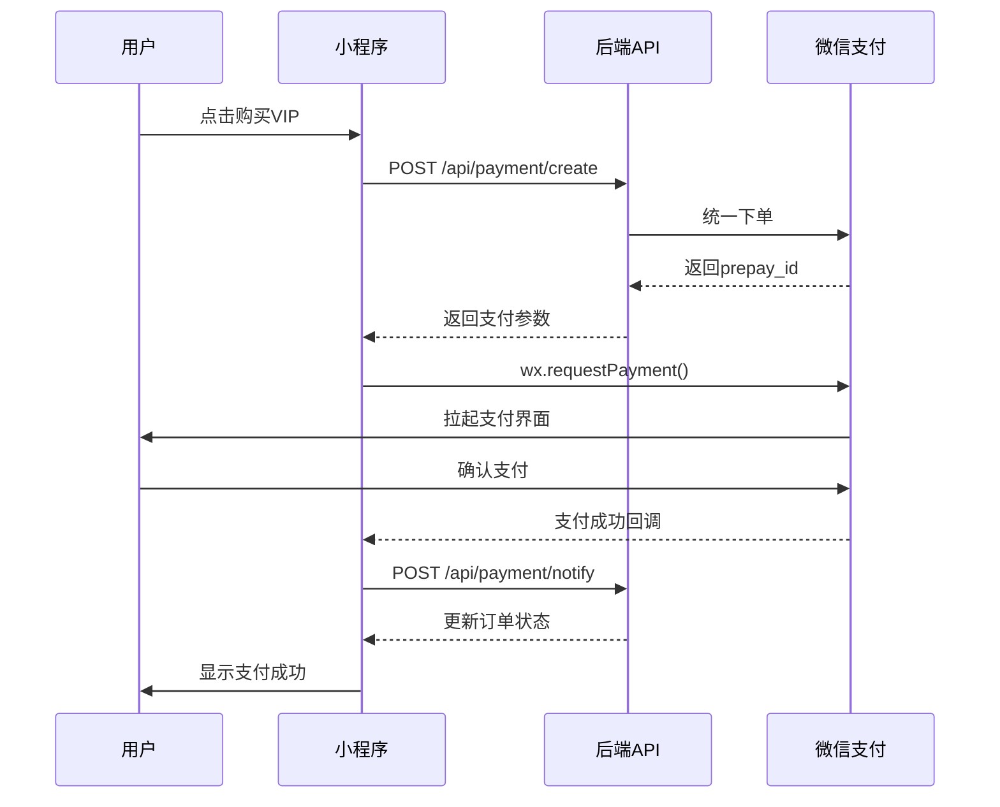

# 💰 微信支付核心代码

> **文件位置**: `miniprogram/utils/payment.js`  
> **复刻来源**: Soul创业实验项目  
> **支付方式**: 微信小程序JSAPI支付

---

## 一、支付流程



---

## 二、核心代码

```javascript
// ========================================
// 文件: miniprogram/utils/payment.js
// 作用: 微信支付工具类
// 核心功能:
//   1. 发起微信支付
//   2. VIP会员购买
//   3. 测试次数购买
//   4. 权限检查
// ========================================

const app = getApp()

/**
 * 发起微信支付（核心函数）
 * @param {Object} options 支付选项
 * @param {String} options.orderId 订单ID
 * @param {Number} options.amount 金额（分）
 * @param {String} options.description 商品描述
 * @param {String} options.productType 商品类型
 */
function wxPay(options) {
  const { orderId, amount, description, productType, success, fail } = options
  
  wx.showLoading({ title: '正在支付...', mask: true })

  // 1. 调用后端创建支付订单
  wx.request({
    url: `${app.globalData.apiBase}/api/payment/create`,
    method: 'POST',
    header: {
      'Authorization': `Bearer ${wx.getStorageSync('token')}`,
      'Content-Type': 'application/json'
    },
    data: {
      orderId,
      amount,
      description,
      productType,
      paymentMethod: 'wechat',
      openId: app.globalData.openId || ''
    },
    success: (res) => {
      wx.hideLoading()
      
      if (res.statusCode === 200 && res.data.code === 200) {
        const paymentData = res.data.data
        
        // 2. 调起微信支付
        wx.requestPayment({
          timeStamp: paymentData.timeStamp,
          nonceStr: paymentData.nonceStr,
          package: paymentData.package,
          signType: paymentData.signType || 'MD5',
          paySign: paymentData.paySign,
          success: (payRes) => {
            // 3. 通知后端支付成功
            notifyPaymentSuccess(orderId, paymentData.prepayId)
            wx.showToast({ title: '支付成功', icon: 'success' })
            success && success(payRes)
          },
          fail: (payErr) => {
            if (payErr.errMsg.indexOf('cancel') !== -1) {
              wx.showToast({ title: '支付已取消', icon: 'none' })
            } else {
              wx.showToast({ title: '支付失败', icon: 'none' })
            }
            fail && fail(payErr)
          }
        })
      } else {
        wx.showToast({ title: res.data.message || '创建订单失败', icon: 'none' })
        fail && fail(res)
      }
    },
    fail: (err) => {
      wx.hideLoading()
      wx.showToast({ title: '网络请求失败', icon: 'none' })
      fail && fail(err)
    }
  })
}

/**
 * 购买VIP会员
 * @param {String} vipType 会员类型: month/quarter/year/lifetime
 */
function purchaseVIP(vipType, success, fail) {
  const prices = {
    month: 1990,      // 19.9元
    quarter: 4990,    // 49.9元
    year: 9900,       // 99元
    lifetime: 19900   // 199元
  }
  
  const names = {
    month: '月度VIP会员',
    quarter: '季度VIP会员',
    year: '年度VIP会员',
    lifetime: '终身VIP会员'
  }
  
  const orderId = `VIP_${Date.now()}_${Math.random().toString(36).substr(2, 9)}`
  
  wxPay({
    orderId,
    amount: prices[vipType],
    description: `MBTI性格测试 - ${names[vipType]}`,
    productType: 'vip',
    success: (res) => {
      updateVIPStatus(vipType)  // 更新本地VIP状态
      success && success(res)
    },
    fail
  })
}

/**
 * 购买测试次数
 * @param {Number} count 购买次数
 */
function purchaseTestCount(count, success, fail) {
  // 阶梯定价: 1次=3.9元, 10次=29元, 50次=99元
  let price = count * 390
  if (count >= 10) price = Math.floor(count * 290)
  if (count >= 50) price = Math.floor(count * 198)
  
  const orderId = `TEST_${Date.now()}_${Math.random().toString(36).substr(2, 9)}`
  
  wxPay({
    orderId,
    amount: price,
    description: `MBTI性格测试 - ${count}次测试次数`,
    productType: 'test_count',
    success: (res) => {
      addTestCount(count)  // 增加本地测试次数
      success && success(res)
    },
    fail
  })
}

/**
 * 检查是否是VIP
 * @returns {Boolean}
 */
function checkVIP() {
  const vipInfo = wx.getStorageSync('vipInfo')
  if (!vipInfo || !vipInfo.isVIP) return false
  
  const expireDate = new Date(vipInfo.expireDate)
  return expireDate > new Date()
}

/**
 * 检查测试权限
 * @param {String} testType 测试类型
 * @returns {Boolean}
 */
function canTakeTest(testType) {
  // VIP用户可无限测试
  if (checkVIP()) return true
  
  // 检查是否已解锁该测试
  const unlockedTests = wx.getStorageSync('unlockedTests') || []
  if (unlockedTests.includes(testType)) return true
  
  // 检查是否有测试次数
  const testCount = wx.getStorageSync('testCount') || 0
  return testCount > 0
}

/**
 * 消耗一次测试次数
 * @returns {Boolean} 是否成功消耗
 */
function consumeTestCount() {
  const testCount = wx.getStorageSync('testCount') || 0
  if (testCount > 0) {
    wx.setStorageSync('testCount', testCount - 1)
    app.globalData.testCount = testCount - 1
    return true
  }
  return false
}

// 导出所有函数
module.exports = {
  wxPay,
  purchaseVIP,
  purchaseTestCount,
  purchaseSingleTest,
  checkVIP,
  canTakeTest,
  consumeTestCount,
  getUserBenefits
}
```

---

## 三、定价策略

### 3.1 VIP会员

| 套餐 | 价格 | 有效期 | 单日成本 |
|:---|:---:|:---:|:---:|
| 月度会员 | ¥19.9 | 30天 | ¥0.66 |
| 季度会员 | ¥49.9 | 90天 | ¥0.55 |
| 年度会员 | ¥99 | 365天 | ¥0.27 |
| 终身会员 | ¥199 | 永久 | - |

### 3.2 测试次数

| 数量 | 价格 | 单次成本 |
|:---:|:---:|:---:|
| 1次 | ¥3.9 | ¥3.9 |
| 10次 | ¥29 | ¥2.9 |
| 50次 | ¥99 | ¥1.98 |

### 3.3 单次解锁

| 测试 | 价格 |
|:---|:---:|
| MBTI测试 | ¥9.9 |
| DISC测试 | ¥6.9 |
| PDP测试 | ¥6.9 |
| AI人脸分析 | ¥19.9 |

---

## 四、后端接口要求

### 4.1 创建订单接口

```typescript
// POST /api/payment/create
// 请求
{
  orderId: "VIP_1706428800000_abc123",
  amount: 1990,  // 分
  description: "MBTI性格测试 - 月度VIP会员",
  productType: "vip",
  paymentMethod: "wechat",
  openId: "oXXXX_xxxxx"
}

// 响应
{
  code: 200,
  data: {
    timeStamp: "1706428800",
    nonceStr: "5K8264ILTKCH16CQ2502SI8ZNMTM67VS",
    package: "prepay_id=wx201410272009395522657a690389285100",
    signType: "MD5",
    paySign: "22D9XXXXXXXXXXXXXXXXXXXXXXXX"
  }
}
```

### 4.2 微信支付商户配置

```yaml
# 使用卡若现有配置
AppID: wx3d15ed02e98b04e3
商户号: 1318592501
API密钥: wx3e31b068be59ddc131b068be59ddc2
```

---

## 五、测试页面中使用支付

```javascript
// pages/test/mbti.js
const payment = require('../../utils/payment')

Page({
  onLoad() {
    // 检查是否有权限测试
    if (!this.checkAccess()) {
      return
    }
    // ... 初始化测试
  },

  checkAccess() {
    const canTest = payment.canTakeTest('mbti')
    
    if (!canTest) {
      wx.showModal({
        title: '需要购买',
        content: '您暂无测试权限，是否前往购买？',
        confirmText: '去购买',
        success: (res) => {
          if (res.confirm) {
            wx.navigateTo({ url: '/pages/purchase/index' })
          } else {
            wx.navigateBack()
          }
        }
      })
      return false
    }
    
    // 消耗测试次数
    const benefits = payment.getUserBenefits()
    if (!benefits.isVIP && !benefits.unlockedTests.includes('mbti')) {
      payment.consumeTestCount()
    }
    
    return true
  }
})
```
